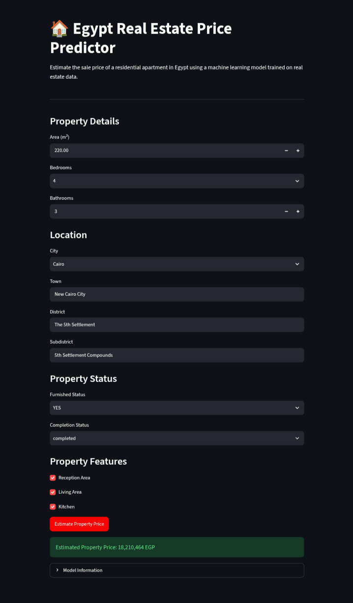

# Smart House Price Predictor

## Live Demo

[Open the Live Demo](https://egypt-house-price-pr6edictor.streamlit.app/)



An end-to-end machine learning web application for estimating apartment sale prices in Egyptian pounds (EGP).

## Project Overview

This project predicts residential apartment sale prices in Egypt using property characteristics and location information.

The project includes data cleaning, feature engineering, leakage prevention, model comparison, hyperparameter tuning, evaluation, model verification, and both Flask and Streamlit web applications. The prediction logic is centralized in `predictor.py`.

## Dataset

The project uses the Egypt Real Estate Data 2026 dataset collected from PropertyFinder Egypt.

Original dataset size: approximately 39,713 listings and 53 columns.

Final modeling dataset: 1,130 high-confidence apartment sale listings.


### Why Were 1,130 Listings Retained?

The original dataset contains different property types and listing purposes, including properties that are not suitable for the final apartment-sale prediction task. After data cleaning, validation, normalization, duplicate and near-duplicate investigation, and task-specific filtering, the project retained 1,130 high-confidence apartment sale listings for modeling.

This reduction was intentional: the final model was trained only on records that matched the project's prediction target and had sufficiently usable property and location information, rather than treating every original listing as a valid training example.

### Dataset Source

The dataset was sourced from Kaggle:

[Real Estate Listings - Egypt](https://www.kaggle.com/datasets/waddahali/real-estate-listings)

The dataset contains real-estate listings collected from PropertyFinder Egypt and was used as the starting point for the project's data preparation and modeling process.

## Target

The target is the full apartment sale price in Egyptian pounds (EGP).

| Statistic | Value |
|---|---:|
| Records | 1,130 |
| Mean | 9,931,202 EGP |
| Median | 8,500,000 EGP |
| Minimum | 1,848,000 EGP |
| Maximum | 39,083,760 EGP |

## Features

The final model uses 13 features.

### Numerical Features

- Area
- Bedrooms
- Bathrooms
- Studio indicator
- Reception indicator
- Living-room indicator
- Kitchen indicator

### Categorical Features

- City
- Town
- District
- Subdistrict
- Furnished status
- Completion status

Target-derived information was not used as an input feature.

Price per square meter was excluded from the model to prevent target leakage.

## Data Preparation

- Data cleaning
- Missing-value handling
- Studio detection
- Text-based feature extraction
- Location normalization
- Area validation
- Duplicate analysis
- Near-duplicate investigation
- Data leakage prevention

## Train/Test Split

A group-aware split was used to reduce the risk of similar properties appearing in both training and testing data.

- Training records: 888
- Test records: 242
- Total groups: 764
- Shared groups between train and test: 0

## Preprocessing

Numerical features use median imputation and standard scaling.

Categorical features use missing-value handling and one-hot encoding with unknown-category support.

## Model Comparison

| Model | MAE (EGP) | RMSE (EGP) | R2 |
|---|---:|---:|---:|
| Linear Regression | 2,673,435 | 3,685,172 | 0.5684 |
| Random Forest | 2,416,804 | 3,491,584 | 0.6126 |
| Gradient Boosting | 2,432,338 | 3,344,718 | 0.6445 |
| Tuned Gradient Boosting | 2,342,225 | 3,321,893 | 0.6493 |

The tuned Gradient Boosting model achieved the best overall test performance.

## Why Gradient Boosting?

Gradient Boosting was selected because it achieved the strongest performance among the evaluated models on the test set.

It outperformed Linear Regression and Random Forest, and the tuned Gradient Boosting model achieved the best results with an R2 of 0.6493, an MAE of 2,342,225 EGP, and an RMSE of 3,321,893 EGP.

The model is well suited to this task because it can learn non-linear relationships between property characteristics, location information, and apartment prices.

## Hyperparameter Tuning

RandomizedSearchCV with GroupKFold cross-validation was used to tune the Gradient Boosting model.

Best parameters:

- Number of estimators: 400
- Learning rate: 0.08
- Maximum depth: 4
- Minimum samples split: 15
- Minimum samples leaf: 1
- Subsample: 1.0
- Random state: 42

## Final Performance

- MAE: 2,342,225 EGP
- RMSE: 3,321,893 EGP
- R2: 0.6493
- Mean absolute percentage error: approximately 27.77%

### How to Interpret These Metrics

An R2 of 0.6493 means that the model explains approximately 65% of the variation in apartment prices in the test set. The remaining variation is influenced by factors that are not fully captured by the available features and by natural variability in real-estate prices.

A mean absolute percentage error (MAPE) of approximately 27.77% means that the average relative prediction error is fairly large. Therefore, the model should be used as a price estimation tool rather than as a method for determining the exact market value of an individual property.

The model provides useful estimates, but predictions should not be treated as exact market valuations.

## Example Prediction

Example input from the deployed application:

| Property Detail | Value |
|---|---|
| Area | 120 m² |
| Bedrooms | 3 |
| Bathrooms | 2 |
| City | Cairo |
| Town | Madinaty |
| District | 1st District |
| Subdistrict | 1st Neighborhood |
| Furnished | No |
| Completion Status | Completed |
| Reception | No |
| Living Room | No |
| Kitchen | No |

**Estimated Property Price: 4,412,751 EGP**

The prediction can be generated by running the application locally or by using the public Streamlit demo.

## Feature Importance

Area is the strongest individual predictor of apartment price.

Location-related features are also highly important, especially subdistrict information.

## Ablation Study

| Feature Set | MAE (EGP) | RMSE (EGP) | R2 |
|---|---:|---:|---:|
| Full Model | 2,342,225 | 3,321,893 | 0.6493 |
| Without Furnished | 2,459,874 | 3,459,324 | 0.6197 |
| Without Subdistrict | 2,438,399 | 3,567,475 | 0.5956 |
| Without Both | 2,511,112 | 3,623,684 | 0.5827 |

## Model Verification

The saved model was reloaded and evaluated again.

The reloaded model produced identical predictions to the original evaluated model.

Maximum prediction difference: 0.0 EGP

## Web Application

The project includes Flask and Streamlit web applications for estimating apartment prices.

Users can enter area, bedrooms, bathrooms, location, furnished status, completion status, reception, living room, and kitchen information.

The application returns the estimated apartment sale price in Egyptian pounds.

## Architecture

```text
User Input
    |
    v
Flask / Streamlit
    |
    v
predictor.py
    |
    +--> Input Validation
    +--> Feature Construction
    +--> Preprocessing
    |
    v
Gradient Boosting Model
    |
    v
Estimated Property Price
```

## Project Structure

Smart-House-Price-Predictor/
|-- app.py
|-- streamlit_app.py
|-- predictor.py
|-- README.md
|-- requirements.txt
|-- .gitignore
|-- models/
|   |-- egypt_real_estate_price_model.joblib
|   |-- model_metadata.joblib
|-- templates/
|   |-- index.html
|-- static/
|   |-- style.css
|-- assets/
|   |-- app_screenshot.png

## Technologies

Python, Pandas, NumPy, Scikit-learn, Joblib, Flask, HTML5, CSS3, Matplotlib, Seaborn, Google Colab, Git, GitHub, and Gunicorn.

## Installation

```bash
git clone https://github.com/qamarsobhy7-source/Smart-House-Price-Predictor.git
cd Smart-House-Price-Predictor
pip install -r requirements.txt
python app.py
```

Open http://127.0.0.1:5000 in your browser.

## Streamlit

The public Streamlit application is available here:

https://egypt-house-price-pr6edictor.streamlit.app/

## Production Deployment

The application can be deployed using Gunicorn:

```bash
gunicorn app:app
```

The deployed application does not depend on Google Colab.

## Limitations

- The dataset represents online property listings rather than every property transaction in Egypt.
- The final target dataset contains 1,130 high-confidence listings.
- Some locations have relatively few examples.
- Luxury and unusual properties may produce larger errors.
- The model has an R2 of 0.6493 and a MAPE of approximately 27.77%, so individual predictions can have substantial error.
- Real-estate market conditions and prices can change over time, which may affect prediction accuracy.
- The available features do not capture every factor that can influence property prices.
- Predictions are estimates and are not official property valuations.

## Future Improvements

- Expand the verified training dataset
- Add more property attributes
- Add richer amenities
- Add geographic features
- Test advanced boosting models
- Add prediction intervals
- Add automated model retraining
- Add production monitoring

## Author

Qamar Sobhy

## License

This project is provided for educational and portfolio purposes.
