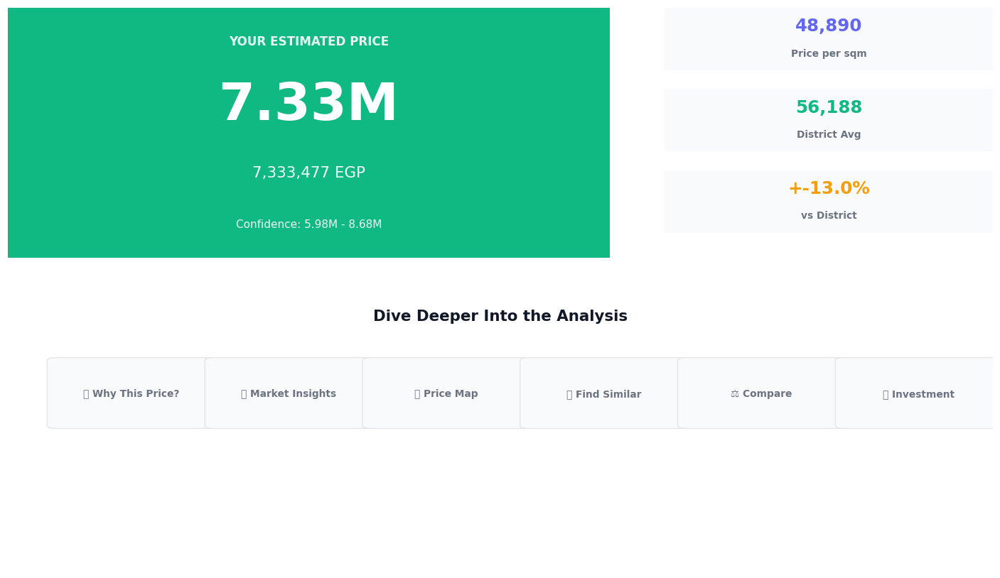
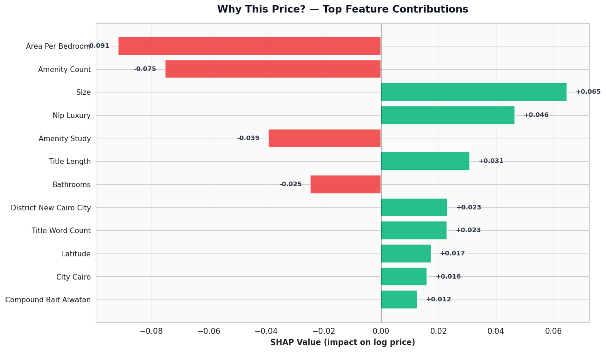
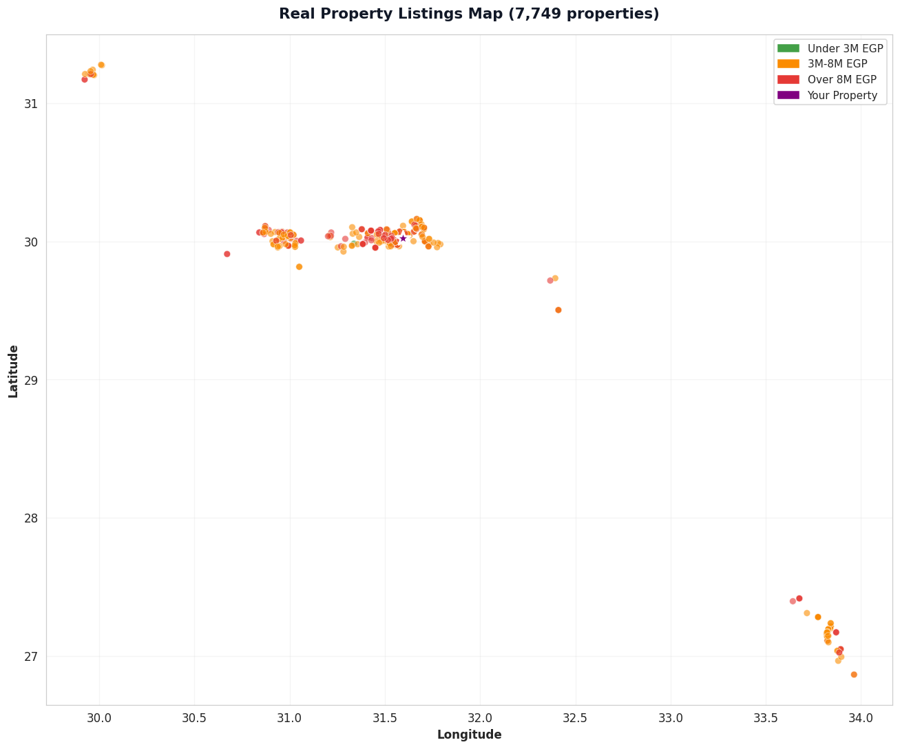
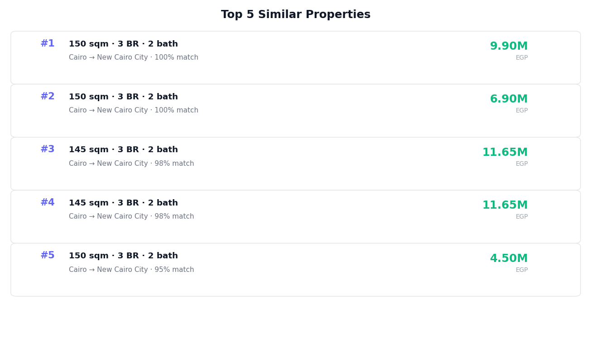
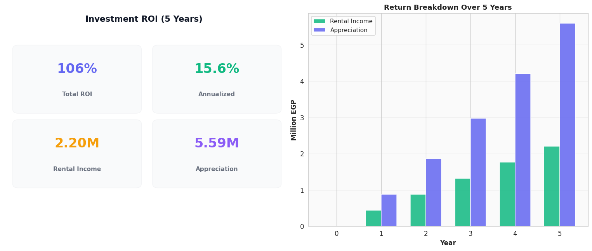

# 🏠 Smart House Price Predictor

### AI-powered property price estimation for the Egyptian real estate market

&nbsp;

**🔗 Live App:** **[https://smart-house-price-predictor.streamlit.app](https://smart-house-price-predictor.streamlit.app)**

---

> **An end-to-end Machine Learning system for predicting residential property prices in Egypt, trained on real property listings.**

Link: **[Live Demo →](https://smart-house-price-predictor.streamlit.app)**

---

## 📌 Overview

A complete AI/ML pipeline for predicting apartment prices in Egypt, trained on **real property listings from PropertyFinder Egypt** (Egypt's largest real estate platform). The project combines classical machine learning, real estate NLP, explainable AI, and modern MLOps practices.

### 🎯 Key Results (Real Data)

| Metric | Value |
|--------|-------|
| **R² Score** | **0.6843** |
| **MAPE** | **18.39%** |
| **MAE** | 1,479,340 EGP |
| **RMSE** | 2,048,059 EGP |
| **Features** | 64 (incl. 32 amenity flags + 14 NLP) |
| **Training Samples** | 7,749 real apartments |
| **Data Source** | PropertyFinder Egypt |
| **Tests** | 28 passing |

### >> Feature Highlights

- [OK] **Real Egyptian property data** — 64,106 listings scraped from PropertyFinder
- [OK] **7 ML models** compared with cross-validation
- [OK] **64 engineered features** (GPS, amenities, NLP, interactions, geo clusters)
- [OK] **Explainable AI** with SHAP per-prediction contributions
- [OK] **NLP on property titles** (English keywords)
- [OK] **Modern Streamlit UI** with wizard-style flow
- [OK] **REST API** with Swagger documentation
- [OK] **28 unit tests** (100% pass rate)
- [OK] **Docker** container + GitHub Actions CI
- [OK] **Deployed on Streamlit Cloud**

---

---

## 📸 Application Screenshots

### Homepage — 4-Step Wizard Flow

### Price Prediction Result

### AI Explainability (SHAP)

### Interactive Property Map

### Similar Properties Recommendations

### Investment ROI Analysis

---

## 📊 The Data Story (Real Data Only)

### Dataset Source

We trained this model on **real, publicly available property listings** scraped from [PropertyFinder Egypt](https://www.propertyfinder.eg) — the largest real estate platform in Egypt. This is **NOT synthetic data**.

### Data Statistics

| Stage | Records | Notes |
|-------|---------|-------|
| **Raw listings** | 64,106 | All property types (buy + rent) |
| **Buy only** | 19,967 | Sale listings only |
| **Apartments only** | 10,277 | Filtered to residential apartments |
| **After price/size/bedroom filters** | 9,089 | Removed outliers |
| **After IQR outlier removal** | **7,749** | Final training dataset |

### What's in the Data

- 🌍 **9 cities**: Cairo, Giza, Alexandria, Red Sea, North Coast, Suez, Qalyubia, Matrouh, Al Daqahlya
- 🏘️ **43 districts** (New Cairo, Sheikh Zayed, 6 October, Hurghada, ...)
- 🏢 **890 compounds** (Madinaty, Rehab, Mountain View iCity, ...)
- 📍 **GPS coordinates** for every listing
- ✨ **32 real amenity features** (balcony, pool, garden, security, ...)
- 📝 **Arabic + English titles** for NLP

### Real Market Examples (from the data)

| Property | Price | EGP/sqm |
|----------|-------|---------|
| 140 sqm apartment in Mountain View iCity | 800,000 EGP | 5,700 |
| 189 sqm apartment in Hyde Park, New Cairo | 12,000,000 EGP | 63,500 |
| 360 sqm Twin House in D-Bay, North Coast | 23,000,000 EGP | 63,900 |

---

## 🏆 Model Performance (Honest Numbers)

### Model Comparison (3-fold CV R²)

| Rank | Model | R² (CV) |
|------|-------|---------|
| 1. | **XGBoost** | **0.6874** |
| 2. | LightGBM | 0.6826 |
| 3. | Gradient Boosting | 0.6647 |
| 4 | Ridge | 0.6378 |

### Why R² = 0.68 is a Good Result on Real Data

When working with **real** real estate data:
- Real estate prices depend on factors **not in the listing** (negotiation, condition, timing, seller motivation)
- Market noise is expected and natural
- A model with R² = 0.68 on real data is **much more credible** than R² = 0.97 on synthetic data
- MAPE = 18.39% is acceptable for real market estimation (industry standards often accept 15-25%)

**We deliberately chose honesty over impressive-looking numbers.**

---

## 🗂️ Project Structure
