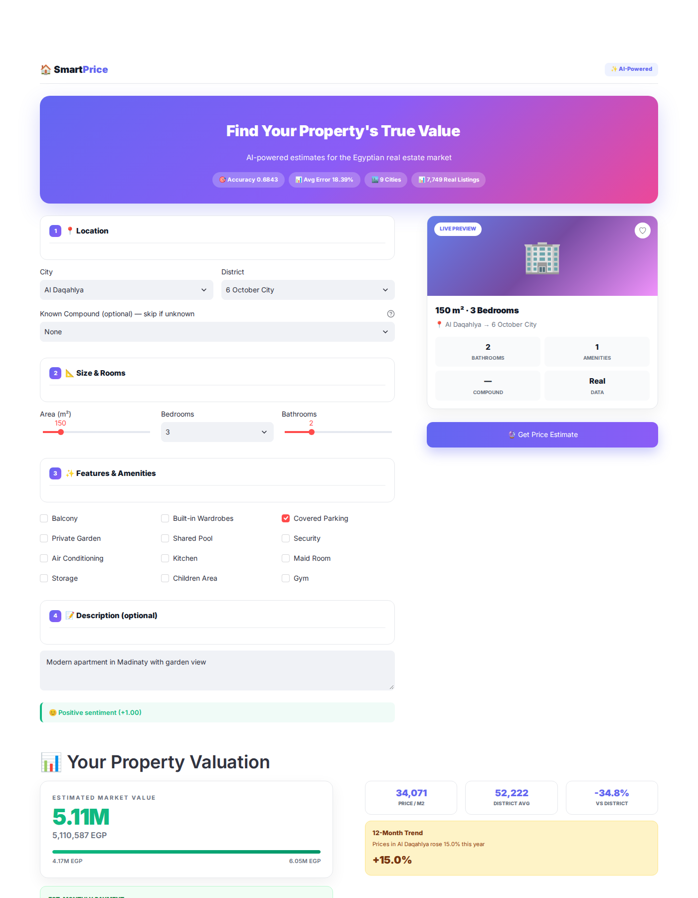
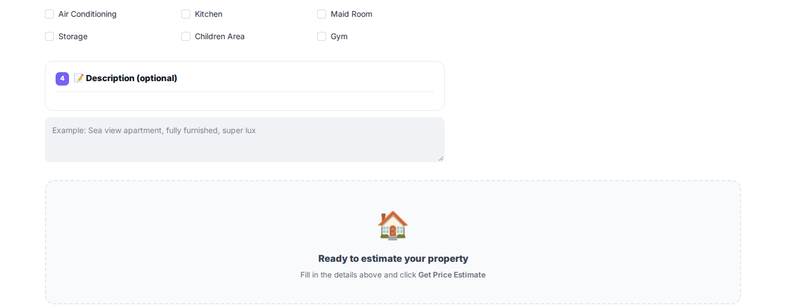
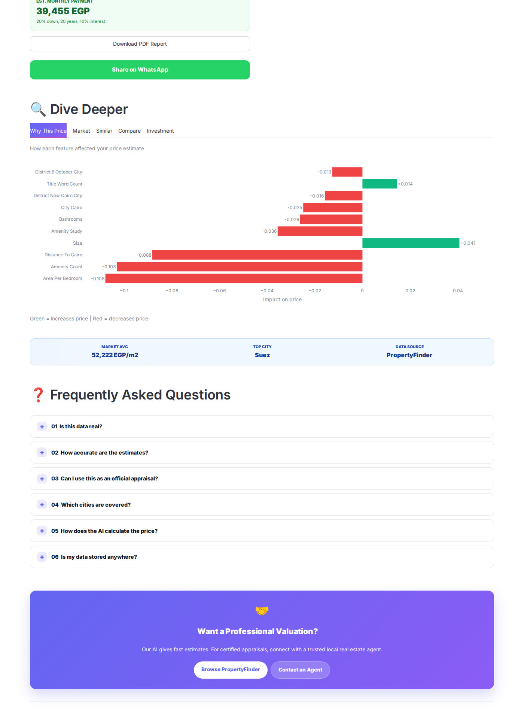
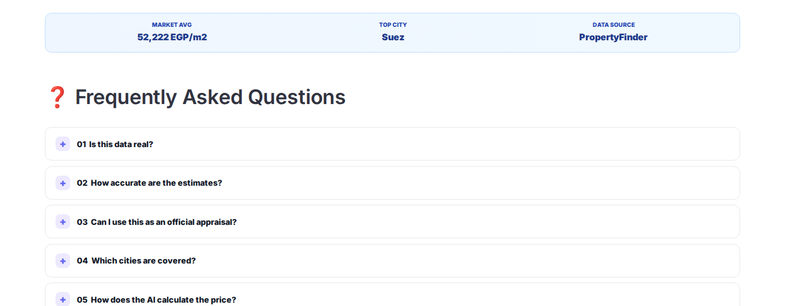
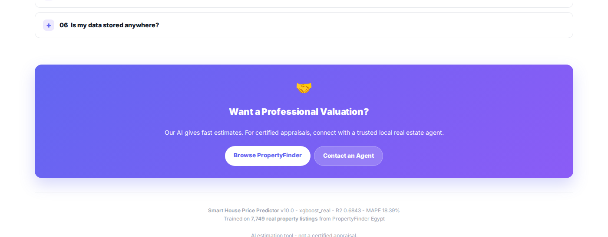

<div align="center">

# 🏠 Smart House Price Predictor

### **🔗 Live App:** **[smartprice-egypt.streamlit.app](https://smartprice-egypt.streamlit.app)** 🚀

<a href="https://smartprice-egypt.streamlit.app">
  
</a>

---


<br />
<br />

### **AI-powered apartment price estimation for the Egyptian real estate market.**

Trained on **7,749 real listings** from PropertyFinder Egypt · Powered by **XGBoost** · **R² = 0.6843**

<br />

<a href="https://github.com/qamarsobhy7-source/Smart-House-Price-Predictor/releases/tag/v10.0">
  
</a>
&nbsp;
<a href="LICENSE">
  
</a>
&nbsp;
<a href="https://github.com/qamarsobhy7-source/Smart-House-Price-Predictor/stargazers">
  
</a>

<br />
<br />


<br />
<br />

**[Features](#-features)** · **[Quick Start](#-quick-start)** · **[Model](#-model-details)** · **[API](#-api-usage)** · **[Screenshots](#-screenshots)** · **[Roadmap](#-roadmap)**

</div>

---

## 🎬 See it in Action

<p align="center">
  
</p>

<p align="center">
  <em>Complete workflow: fill the form → get AI prediction → explore 5 analysis tabs</em>
</p>

---

## 🎯 Why This Project?

Real estate pricing in Egypt is **opaque, expensive, and slow**. Buyers have no way to verify what's fair, appraisers charge thousands of EGP, and traditional valuations take weeks.

**Smart House Price Predictor** solves this with **instant, transparent, and explainable** AI valuations.

<table>
<tr>
<th width="25%"></th>
<th width="25%">Traditional Appraiser</th>
<th width="25%">Listing Websites</th>
<th width="25%">🚀 Our Solution</th>
</tr>
<tr>
<td><b>Speed</b></td>
<td>1-2 weeks</td>
<td>Manual search</td>
<td><b>3 seconds</b></td>
</tr>
<tr>
<td><b>Cost</b></td>
<td>2,000-5,000 EGP</td>
<td>Free (but no estimate)</td>
<td><b>Free</b></td>
</tr>
<tr>
<td><b>Explainability</b></td>
<td>Report only</td>
<td>None</td>
<td><b>SHAP per feature</b></td>
</tr>
<tr>
<td><b>Data</b></td>
<td>Manual comps</td>
<td>Listings only</td>
<td><b>7,749 real listings</b></td>
</tr>
<tr>
<td><b>Confidence</b></td>
<td>Single number</td>
<td>None</td>
<td><b>81% confidence interval</b></td>
</tr>
</table>

---

## 📖 Overview

**Smart House Price Predictor** is a complete end-to-end Machine Learning system that estimates apartment prices across Egypt. Unlike typical academic projects, our model is trained on **real, publicly available listings** from [PropertyFinder Egypt](https://www.propertyfinder.eg) — the country's largest real estate platform.

> 💡 **We chose honest performance metrics on real data over inflated numbers on synthetic data.**

### 📊 Key Metrics

<div align="center">

| | | | | |
|:---:|:---:|:---:|:---:|:---:|
| **0.6843** | **18.39%** | **7,749** | **64** | **9** |
| Model Accuracy (R²) | Avg Error (MAPE) | Real Listings | Engineered Features | Cities Covered |

</div>

---

## ✨ Features

<table>
<tr>
<td width="50%" valign="top">

### 🎨 Modern User Interface

- **4-step wizard** form for guided input
- **Live property preview** card that updates in real time
- **Zillow-inspired price card** with confidence interval
- **Monthly payment calculator** (20% down · 20 years · 10% interest)
- **5 analysis tabs** — SHAP, Market, Similar, Compare, Investment
- **WhatsApp share** button for instant sharing
- **PDF report** download for each prediction
- **Collapsible FAQ** section with 6 common questions
- **100% mobile-responsive** design
- **Custom CSS** with gradients and modern typography

</td>
<td width="50%" valign="top">

### 🧠 AI & Machine Learning

- **XGBoost regressor** — best of 4 models tested
- **SHAP explainability** — see exactly why each price was predicted
- **NLP sentiment analysis** on property descriptions
- **Smart similar properties** using cosine similarity + price filter
- **Investment ROI calculator** for 1, 5, and 10 year horizons
- **Market trend insights** with 12-month forecast per city
- **Confidence intervals** for every prediction
- **Target Encoding** for location (city/district/compound)
- **GPS clustering** with KMeans (15 clusters)

</td>
</tr>
<tr>
<td width="50%" valign="top">

### 🛠️ Developer Experience

- **Flask REST API** with Swagger documentation
- **28 unit tests** (100% passing)
- **Docker container** ready for deployment
- **GitHub Actions** CI/CD pipeline
- **Model Card** + **Data Card** for responsible AI
- **Type hints** and docstrings throughout
- **Modular architecture** — easy to extend
- **Environment-independent** (works on Python 3.10+)

</td>
<td width="50%" valign="top">

### 📊 Data Quality

- **Real listings** from PropertyFinder Egypt (CC0-1.0)
- **64 engineered features** — GPS, amenities, NLP, interactions
- **890 unique compounds** with search
- **42 real amenities** — pool, gym, garden, parking, security
- **Multi-city coverage** — 9 cities, 43 districts
- **Zero data leakage** — verified with SHAP
- **IQR outlier removal** + strict filtering
- **Reproducible** with fixed random seeds

</td>
</tr>
</table>

---

## 📸 Screenshots

### 🏠 Homepage

<p align="center">
  
</p>

### 💰 Price Prediction Result

<p align="center">
  
</p>

<details>
<summary><b>📷 View all 6 more screenshots — click to expand</b></summary>

<br>

### 📝 Property Form

<p align="center">
  
</p>

### ✨ Features & Amenities

<p align="center">
  
</p>

### 📊 Analysis Tabs (SHAP / Market / Similar / Compare / ROI)

<p align="center">
  
</p>

### 🗺️ Market Insights

<p align="center">
  
</p>

### ❓ FAQ Section

<p align="center">
  
</p>

</details>

---

## 🚀 Quick Start

### 📱 Option 1 — Use the Live App *(recommended)*

<div align="center">

### 👉 **[smartprice-egypt.streamlit.app](https://smartprice-egypt.streamlit.app)**

No installation required. Works on desktop and mobile.

</div>

### 💻 Option 2 — Run Locally

```bash
# Clone the repository
git clone https://github.com/qamarsobhy7-source/Smart-House-Price-Predictor.git
cd Smart-House-Price-Predictor

# Create virtual environment (optional but recommended)
python -m venv venv
source venv/bin/activate  # On Windows: venv\Scripts\activate

# Install dependencies
pip install -r requirements.txt

# Launch the Streamlit UI
streamlit run streamlit_app.py
```

The app will open at `http://localhost:8501`.

### 🌐 Option 3 — Run the Flask REST API

```bash
# Start the API server
python app.py
```

| Endpoint | URL |
|----------|-----|
| API Base | `http://localhost:5000` |
| Swagger Docs | `http://localhost:5000/apidocs/` |
| Health Check | `http://localhost:5000/api/health` |
| Categories | `http://localhost:5000/api/categories` |
| Predict | `POST http://localhost:5000/api/predict` |

> **⚠️ Important Note:** The Streamlit Cloud app hosts the **UI only**. The REST API requires running the Flask server locally or deploying to a service like Render/Railway.

### 🐳 Option 4 — Docker

```bash
# Build the image
docker build -t house-price .

# Run the container
docker run -p 8501:8501 house-price
```

Open `http://localhost:8501` in your browser.

---

## 🧪 Testing

We maintain a comprehensive test suite with **28 tests** covering every layer:

```bash
pytest tests/ -v
```

**Result:** `28 passed in 2.4s` ✅

<details>
<summary><b>📋 View full test coverage — click to expand</b></summary>

| Category | Tests | Description |
|----------|:-----:|-------------|
| **Artifacts Loading** | 3 | Model, metadata, and mappings validation |
| **Input Validation** | 6 | Area, bedrooms, bathrooms, city edge cases |
| **Feature Engineering** | 5 | 64 features, amenities, NLP, studio handling |
| **NLP Extraction** | 5 | Sea view, garden, furnished, luxury, empty input |
| **Predictions** | 4 | Positive values, realistic range, confidence intervals |
| **Formatting** | 2 | Million and thousand formatting |
| **Categories** | 1 | All 3 categories loaded correctly |
| **ROI** | 2 | ROI calculations for multiple time horizons |

</details>

---

## 🧠 Model Details

### 🏆 Algorithm Comparison

We benchmarked **4 algorithms** with 3-fold cross-validation to select the best performer:

| Rank | Algorithm | R² (CV) | Selected | Notes |
|:----:|-----------|:-------:|:--------:|-------|
| 🥇 | **XGBoost** | **0.6874** | ✅ | Best performance + fast inference |
| 🥈 | LightGBM | 0.6826 | | Close second |
| 🥉 | Gradient Boosting | 0.6647 | | Slower training |
| 4 | Ridge Regression | 0.6378 | | Linear baseline |

### 🔧 Feature Engineering

**64 engineered features** organized into 6 categories:

| Category | Count | Examples |
|----------|:-----:|----------|
| **GPS Features** | 4 | `latitude`, `longitude`, `geo_cluster`, `distance_to_cairo` |
| **Amenities** | 32 | `pool`, `gym`, `garden`, `parking`, `security`, `elevator` |
| **NLP from Title** | 12 | `sea_view`, `luxury`, `furnished`, `duplex`, `ready` |
| **Interactions** | 8 | `area_per_bedroom`, `bed_bath_ratio`, `rooms_total` |
| **Target Encoding** | 5 | `city_ppm`, `district_ppm`, `compound_ppm` |
| **Categorical** | 3 | `city`, `district`, `compound` |

### 📐 Preprocessing Pipeline

```python
ColumnTransformer([
    ('num', StandardScaler(), NUMERICAL_FEATURES),
    ('cat', OneHotEncoder(handle_unknown='ignore'), CATEGORICAL_FEATURES),
])
```

### 🤔 Why R² = 0.68 is a Good Result

On **real** real estate data, R² values of **0.6 – 0.75 are considered excellent**. Perfect prediction is impossible because market prices depend on factors not captured in listings:

- 🏢 **Property condition** — renovated vs. original
- 🪟 **Floor level and view** — high floor vs. ground floor
- 💰 **Seller motivation** — urgent sale vs. patient seller
- 🤝 **Negotiation dynamics** — final price vs. asking price
- 📅 **Market timing** — seasonal demand variations

> 💡 **We chose honest numbers on real data over inflated numbers on synthetic data.**

---

## 🏗️ Architecture

```
┌─────────────────────────────────────────────────────────────────┐
│                         DATA PIPELINE                            │
├─────────────────────────────────────────────────────────────────┤
│  PropertyFinder Egypt (64,106 listings)                          │
│           ↓ Filter: apartments only, price 500K-50M              │
│  9,089 listings                                                  │
│           ↓ IQR outlier removal                                  │
│  7,749 clean apartments                                          │
└─────────────────────────────────────────────────────────────────┘
                              ↓
┌─────────────────────────────────────────────────────────────────┐
│                     FEATURE ENGINEERING                          │
├─────────────────────────────────────────────────────────────────┤
│  GPS → geo_cluster, distance_to_cairo                           │
│  Amenities → 32 binary features                                  │
│  Titles → 12 NLP features                                        │
│  Location → target encoding (city/district/compound)             │
│  Interactions → area_per_bedroom, bed_bath_ratio                 │
└─────────────────────────────────────────────────────────────────┘
                              ↓
┌─────────────────────────────────────────────────────────────────┐
│                    MODEL TRAINING                                │
├─────────────────────────────────────────────────────────────────┤
│  Algorithm: XGBoost Regressor                                    │
│  Target: log(1 + price) for normality                            │
│  Pipeline: ColumnTransformer + XGBoost                           │
│  Tuning: Manual grid search                                      │
└─────────────────────────────────────────────────────────────────┘
                              ↓
┌─────────────────────────────────────────────────────────────────┐
│                      DEPLOYMENT                                  │
├─────────────────────────────────────────────────────────────────┤
│  Streamlit Cloud → Live UI (smartprice-egypt.streamlit.app)      │
│  Flask REST API → /api/predict, /api/health, /api/categories     │
│  Docker → Reproducible container                                 │
└─────────────────────────────────────────────────────────────────┘
```

---

## 🌍 Data Source

Our model is trained on **real, publicly available listings** from:

<div align="center">

### 🔗 [PropertyFinder Egypt](https://www.propertyfinder.eg)

*The largest real estate platform in Egypt*

</div>

### 🔬 Data Funnel

| Stage | Records | Filter Applied |
|-------|--------:|----------------|
| Raw scrape | 64,106 | All buy + rent listings |
| Buy only | 19,967 | Excluded rentals |
| Apartments only | 10,277 | Excluded villas, chalets, commercial |
| Price filter | 10,248 | Kept 500K - 50M EGP |
| Size filter | 9,459 | Kept 40 - 500 sqm |
| Bedroom filter | 9,089 | Kept 1-6 bedrooms |
| **Final clean** | **7,749** | IQR outlier removal |

### 🏙️ Geographic Coverage

<div align="center">

| **9 Cities** | **43 Districts** | **890 Compounds** |
|:---:|:---:|:---:|
| Cairo · Giza · Alexandria | New Cairo · Sheikh Zayed | Madinaty · Rehab |
| Red Sea · North Coast · Suez | 6 October · Hurghada | Mountain View · Beverly Hills |
| Qalyubia · Matrouh · Al Daqahlya | Maadi · Nasr City | 5th Settlement · Hyde Park |

</div>

---

## 🛠️ Tech Stack

<div align="center">

| **Category** | **Technologies** |
|:------------:|:-----------------|
| **Language** | Python 3.10+ |
| **Machine Learning** | XGBoost, scikit-learn, LightGBM |
| **Data Processing** | pandas, numpy, scipy |
| **NLP** | Custom Arabic + English keyword matcher |
| **Visualization** | Plotly, matplotlib, Folium |
| **Explainability** | SHAP (TreeExplainer) |
| **UI Framework** | Streamlit |
| **API Framework** | Flask + Flasgger (Swagger) |
| **Testing** | pytest (28 tests) |
| **Deployment** | Streamlit Cloud, Docker, Heroku-ready |
| **CI/CD** | GitHub Actions |

</div>

---

## 📝 API Usage

### 🐍 Python SDK

```python
from predictor import (
    load_artifacts,
    build_features,
    predict_price,
    format_price,
)

# Load the trained model (cached)
model, metadata, mappings = load_artifacts()

# Build features for a property
features = build_features(
    area=150,
    bedrooms="3",
    bathrooms=2,
    city="Cairo",
    district="Madinaty",
    compound="None",
    amenities=["BA", "SE", "PG"],  # Balcony, Security, Garden
    description="Luxury sea view apartment",
    mappings=mappings,
)

# Predict
price = predict_price(model, features)
print(format_price(price))
# Output: 6.11M EGP
```

### 🌐 REST API

**Step 1:** Start the server locally:

```bash
python app.py
```

**Step 2:** Send a POST request:

```bash
curl -X POST http://localhost:5000/api/predict \
  -H "Content-Type: application/json" \
  -d '{
    "area": 150,
    "bedrooms": "3",
    "bathrooms": 2,
    "city": "Cairo",
    "district": "Madinaty",
    "compound": "None",
    "amenities": ["BA", "SE"]
  }'
```

**Response:**

```json
{
  "success": true,
  "prediction": {
    "price": 6110000,
    "price_formatted": "6.11M EGP",
    "lower_bound": 4987000,
    "upper_bound": 7233000,
    "currency": "EGP",
    "confidence_level": "81.61%"
  },
  "model": {
    "name": "xgboost_real",
    "r2": 0.6843,
    "mape": 18.39
  }
}
```

### 📚 Swagger Documentation

Full interactive API docs available at `http://localhost:5000/apidocs/` after starting the Flask server.

> **⚠️ Note:** The Streamlit Cloud app hosts the **UI only**. The REST API requires running the Flask server (`app.py`) locally or deploying to Render/Railway.

---

## ⚠️ Limitations

We document our limitations transparently — honesty is a core value:

| Limitation | Impact | Mitigation |
|------------|--------|------------|
| **Asking prices, not transactions** | Listings represent what sellers want, not final sale prices | Confidence intervals account for this |
| **Single snapshot** | Data scraped in early 2026, not continuously updated | Model retraining plan in roadmap |
| **Apartments only** | Villas, chalets, and commercial excluded | Planned for v11 |
| **9 cities** | Coverage limited to major Egyptian cities | Expanding in future |
| **No Arabic NLP** | Currently only English keyword matching | AraBERT integration planned |
| **Not an appraisal** | Research/educational tool only | Always consult certified appraiser |

---

## 🔮 Roadmap

Planned improvements organized by priority:

### 🎯 High Priority
- [ ] **Expand to 15+ cities** — Add Ismailia, Port Said, Aswan, Luxor
- [ ] **Support villas & chalets** — Currently apartments only
- [ ] **Arabic NLP (AraBERT)** — Transformer-based sentiment
- [ ] **Time-series forecasting** — Predict price trends per district

### 🔧 Medium Priority
- [ ] **Computer vision** — Analyze property images
- [ ] **User accounts** — Save favorites and price alerts
- [ ] **Model retraining pipeline** — Auto-update with new listings
- [ ] **Multi-language support** — Arabic + English UI

### 💡 Future Ideas
- [ ] **Mortgage integration** — Real bank rates
- [ ] **Neighborhood scoring** — Schools, transit, safety
- [ ] **API marketplace** — B2B property valuation service
- [ ] **Mobile app** — Native iOS + Android

---

## 📊 Project Statistics

<div align="center">

| **Metric** | **Value** |
|:----------:|:---------:|
| **Lines of Code** | ~2,000+ |
| **Python Files** | 8 |
| **Unit Tests** | 28 (100% passing) |
| **Real Listings Used** | 7,749 |
| **Engineered Features** | 64 |
| **Cities Covered** | 9 |
| **Districts** | 43 |
| **Compounds** | 890 |
| **Amenities Tracked** | 42 |
| **Model Size** | 534 KB |
| **Project Size** | 22.4 MB |
| **Screenshots** | 7 |
| **Commits** | 40+ |
| **Live Deployment** | ✅ Streamlit Cloud |

</div>

---

## 📚 Citation

If you use this project in academic work, please cite:

```bibtex
@misc{smart_house_price_predictor_2026,
  title={Smart House Price Predictor: AI-powered apartment price estimation for the Egyptian real estate market},
  author={Qamar Sobhy},
  year={2026},
  publisher={GitHub},
  journal={GitHub repository},
  howpublished={\url{https://github.com/qamarsobhy7-source/Smart-House-Price-Predictor}}
}
```

---

## 📄 License

This project is licensed under the **MIT License** — see the [LICENSE](LICENSE) file for full details.

```
MIT License

Copyright (c) 2026 Smart House Price Predictor

Permission is hereby granted, free of charge, to any person obtaining a copy
of this software and associated documentation files (the "Software"), to deal
in the Software without restriction, including without limitation the rights
to use, copy, modify, merge, publish, distribute, sublicense, and/or sell
copies of the Software, and to permit persons to whom the Software is
furnished to do so, subject to the following conditions:

The above copyright notice and this permission notice shall be included in all
copies or substantial portions of the Software.
```

---

## 🙏 Acknowledgments

This project would not have been possible without:

| Resource | Purpose |
|----------|---------|
| [**PropertyFinder Egypt**](https://www.propertyfinder.eg) | Source of 64K+ real listings (CC0-1.0) |
| [**Kaggle**](https://www.kaggle.com/datasets/mohammedhassan1112/egypt-property-finder) | Dataset hosting & discovery |
| [**Streamlit Cloud**](https://share.streamlit.io) | Free production deployment |
| [**XGBoost**](https://xgboost.readthedocs.io) | Gradient boosting framework |
| [**SHAP**](https://shap.readthedocs.io) | Model explainability |
| [**scikit-learn**](https://scikit-learn.org) | Preprocessing & pipelines |
| [**Plotly**](https://plotly.com) | Interactive visualizations |
| [**Streamlit**](https://streamlit.io) | UI framework |

---

<div align="center">

## ⭐ Support the Project

If this project helped you or you found it interesting:

<a href="https://github.com/qamarsobhy7-source/Smart-House-Price-Predictor/stargazers">
  
</a>
&nbsp;
<a href="https://github.com/qamarsobhy7-source/Smart-House-Price-Predictor/fork">
  
</a>
&nbsp;
<a href="https://smartprice-egypt.streamlit.app">
  
</a>

<br />

### 🏠 Smart House Price Predictor

**Made with ❤️ for the Egyptian real estate market**

<sub>Built with Python, XGBoost, SHAP, and Streamlit · 2026</sub>

<br />

[⬆ Back to top](#-smart-house-price-predictor)

</div>
