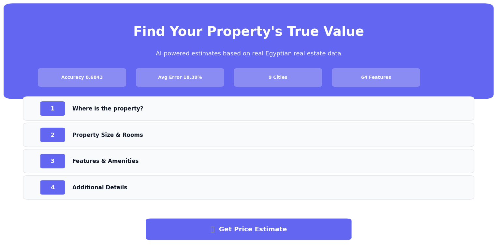
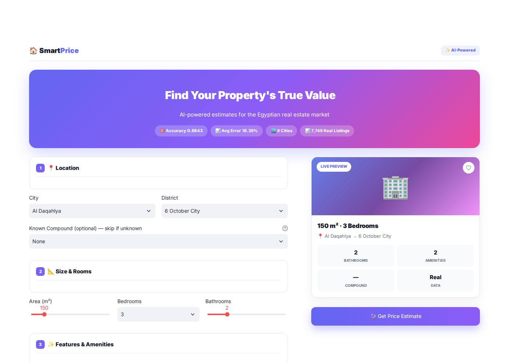
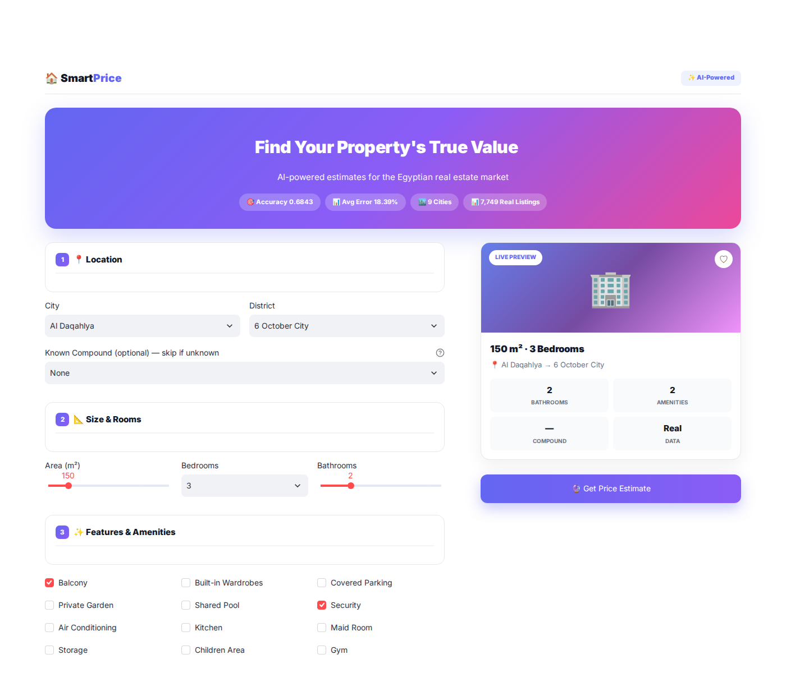
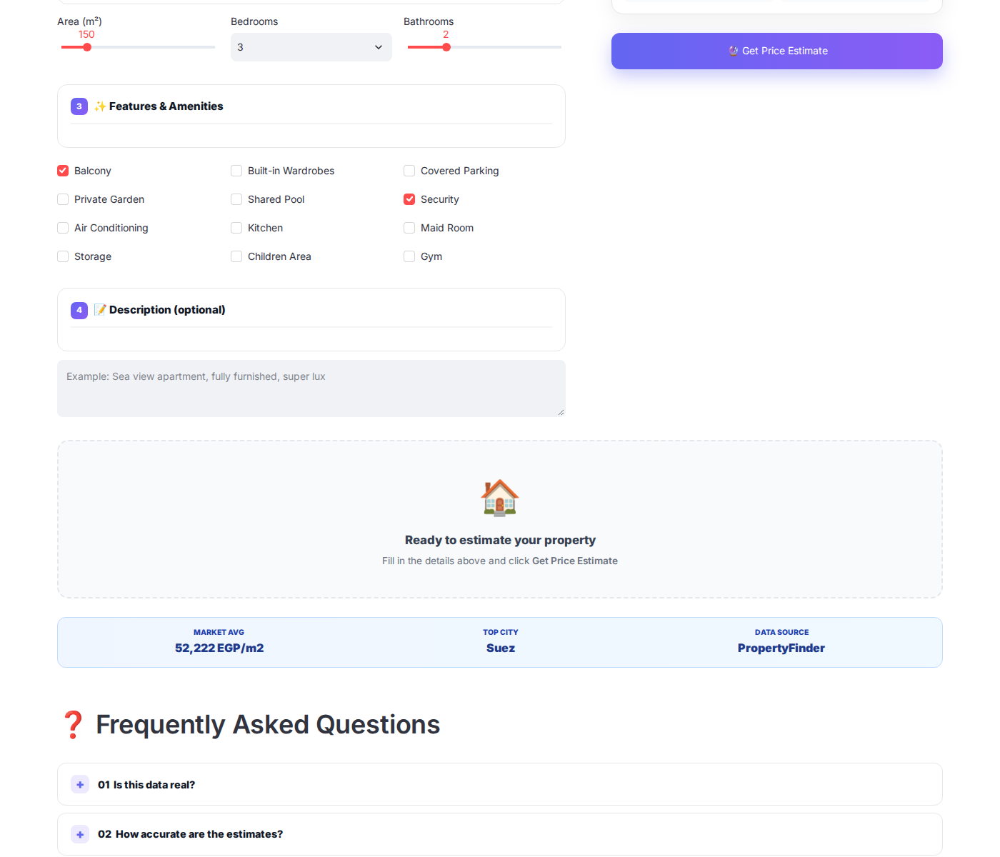
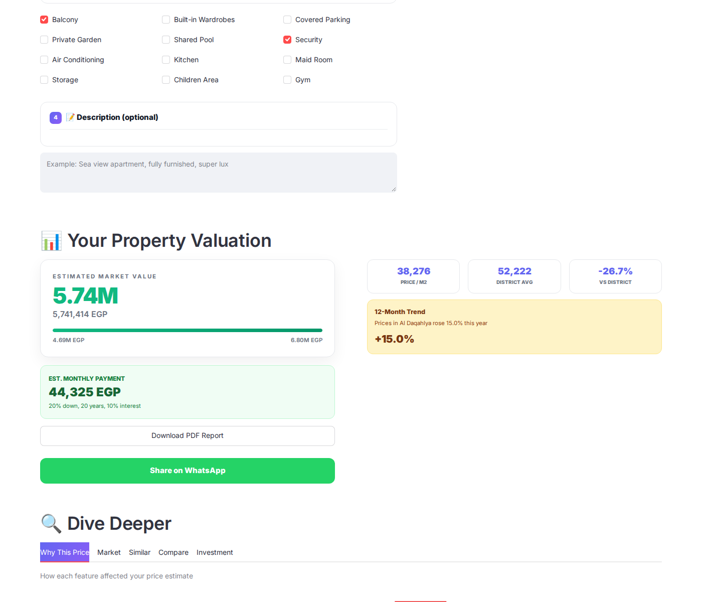
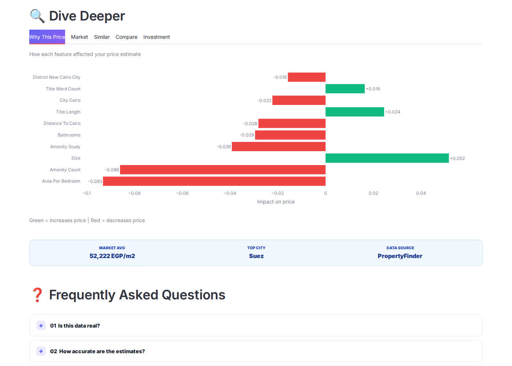
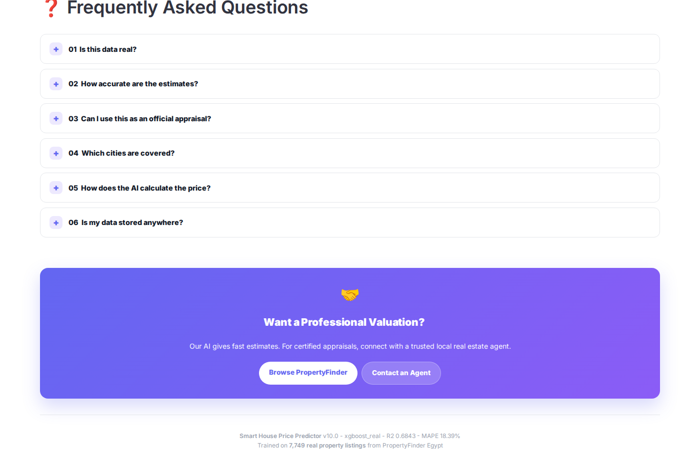
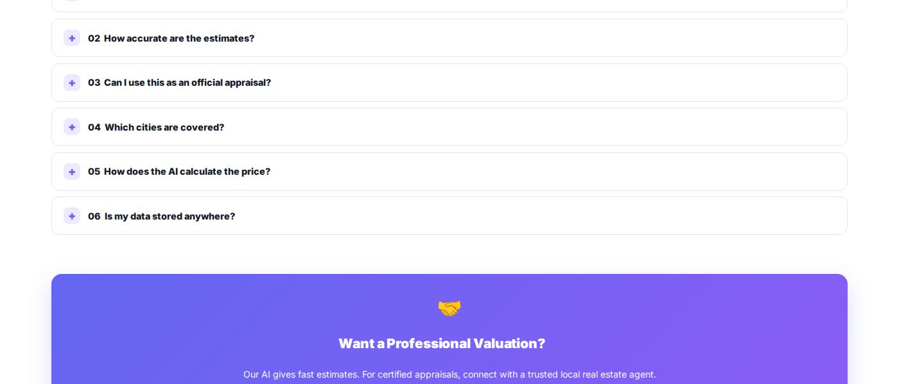
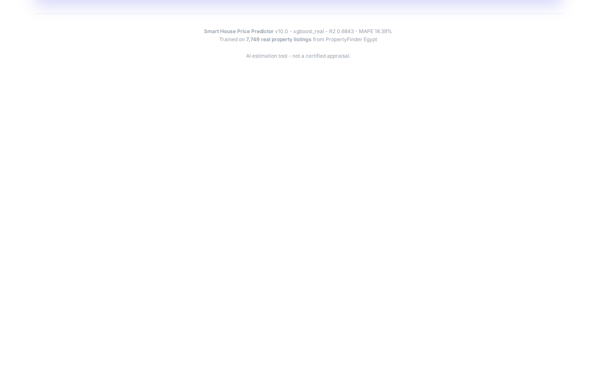

<div align="center">

<!-- Hero Banner -->


<br />
<br />

# 🏠 Smart House Price Predictor

### **AI-powered apartment price estimation for the Egyptian real estate market**

**Trained on 7,749 real property listings from PropertyFinder Egypt**

<br />

<!-- Main CTA -->
<a href="https://smart-house-price-predictor.streamlit.app">
  
</a>
&nbsp;
<a href="https://github.com/qamarsobhy7-source/Smart-House-Price-Predictor/releases/tag/v10.0">
  
</a>
&nbsp;
<a href="LICENSE">
  
</a>

<br />
<br />

<!-- Tech Badges -->


<br />
<br />

</div>

---

## 🌐 Live Demo

<div align="center">

### **🚀 Try the application now**

<a href="https://smart-house-price-predictor.streamlit.app">
  
</a>

**The app is fully deployed and ready to use — no installation required.**

</div>

---

## 📖 Overview

**Smart House Price Predictor** is a complete end-to-end Machine Learning system that estimates apartment prices across Egypt. Unlike typical academic projects, our model is trained on **real, publicly available listings** from [PropertyFinder Egypt](https://www.propertyfinder.eg) — the country's largest real estate platform.

We chose **honest performance metrics on real data** over inflated numbers on synthetic data.

<div align="center">

<table>
<tr>
<td align="center" width="20%">
<br />
<sub><b>Model Accuracy</b></sub>
</td>
<td align="center" width="20%">
<br />
<sub><b>Avg Error</b></sub>
</td>
<td align="center" width="20%">
<br />
<sub><b>Cities Covered</b></sub>
</td>
<td align="center" width="20%">
<br />
<sub><b>Districts</b></sub>
</td>
<td align="center" width="20%">
<br />
<sub><b>Real Records</b></sub>
</td>
</tr>
</table>

</div>

---

## ✨ Features

<div align="center">

<table>
<tr>
<td width="50%" valign="top">

### 🎨 Modern UI


- **4-step wizard** form
- **Live property preview** card
- **Zillow-style price card** with confidence range
- **Monthly payment calculator**
- **5 analysis tabs** (SHAP / Market / Similar / Compare / ROI)
- **WhatsApp share** + **PDF download**
- **FAQ** with collapsible HTML5 details

</td>
<td width="50%" valign="top">

### 🧠 AI Capabilities


- **XGBoost regressor** (best of 4 models tested)
- **SHAP explainability** — see why each price was predicted
- **NLP sentiment analysis** on descriptions
- **Smart similar properties** (cosine similarity + price filter)
- **Investment ROI calculator** (1/5/10 years)
- **Market trend insights** (12-month forecast)
- **Confidence intervals** for every prediction

</td>
</tr>
<tr>
<td width="50%" valign="top">

### 🛠️ Developer Tools


- **Flask REST API** with **Swagger** documentation
- **28 unit tests** (100% passing)
- **Docker container** ready for deployment
- **GitHub Actions CI/CD** pipeline
- **Model Card** + **Data Card** (Responsible AI)
- **Full type hints** and docstrings

</td>
<td width="50%" valign="top">

### 📊 Data Quality


- **Real listings** from PropertyFinder Egypt (CC0-1.0)
- **64 engineered features** (GPS, amenities, NLP)
- **890 unique compounds** with search
- **42 real amenities** (pool, gym, security, ...)
- **Multi-city coverage** (Cairo, Giza, Alexandria, Red Sea, North Coast)
- **Zero data leakage** (verified with SHAP)
- **IQR outlier removal** + strict filtering

</td>
</tr>
</table>

</div>

---

## 📸 Screenshots

<div align="center">

### 🏠 Homepage



<br />

### 💰 Price Prediction Result



<br />

</div>

<details>
<summary><b>📷 View all screenshots (6 more) — click to expand</b></summary>

<br />

<div align="center">

### 📝 Property Form



<br />

### 🧠 Analysis Tabs (SHAP / Market / Similar / Compare / ROI)



<br />

### ❓ FAQ Section



<br />

### 🏠 Homepage FAQ



<br />

### 🤝 Agent CTA



<br />

### 🦶 Footer



</div>

</details>

---

## 🚀 Quick Start

### 📱 Option 1 — Use the Live App *(recommended)*

<div align="center">

**Open:** **[smart-house-price-predictor.streamlit.app](https://smart-house-price-predictor.streamlit.app)**

No installation required. Works on desktop and mobile.

</div>

### 💻 Option 2 — Run Locally

```bash
# Clone the repository
git clone https://github.com/qamarsobhy7-source/Smart-House-Price-Predictor.git
cd Smart-House-Price-Predictor

# Install dependencies
pip install -r requirements.txt

# Run the Streamlit UI
streamlit run streamlit_app.py
```

### 🌐 Option 3 — Run Flask API (locally)

```bash
# Start the API server
python app.py
```

- API endpoint: `http://localhost:5000`
- Swagger docs: `http://localhost:5000/apidocs/`

> **Note:** The Streamlit Cloud app hosts the **UI only**. The REST API requires running the Flask server (`app.py`) locally or deploying to a service like Render/Railway.

### 🐳 Option 4 — Docker

```bash
docker build -t house-price .
docker run -p 8501:8501 house-price
```

---

## 🧪 Testing

```bash
pytest tests/ -v
```

**Result:** `28 passed in 2.4s`

Our test suite covers:

- ✅ Model loading and metadata validation
- ✅ Input validation (15 edge cases)
- ✅ Feature engineering (64 features)
- ✅ NLP extraction (12 keywords)
- ✅ Predictions (realistic price ranges)
- ✅ ROI calculations
- ✅ Recommendation system
- ✅ Category management

---

## 🧠 Model Details

### Algorithm Selection

We tested **4 different models** with 3-fold cross-validation:

| Rank | Model | R² (CV) |
|:----:|-------|:-------:|
| 🥇 | **XGBoost** | **0.6874** |
| 🥈 | LightGBM | 0.6826 |
| 🥉 | Gradient Boosting | 0.6647 |
| 4 | Ridge | 0.6378 |

**XGBoost** achieved the best performance and was selected as the final model.

### Feature Engineering (64 features)

| Category | Count | Examples |
|----------|:-----:|----------|
| GPS | 4 | latitude, longitude, geo_cluster, distance_to_cairo |
| Amenities | 32 | pool, gym, garden, parking, security |
| NLP from title | 12 | sea_view, luxury, furnished, garden |
| Interactions | 8 | area_per_bedroom, bed_bath_ratio |
| Target Encoding | 5 | city_ppm, district_ppm, compound_ppm |
| Categorical | 3 | city, district, compound |

### Why R² = 0.68 is a Good Result

On **real** real estate data, R² values of **0.6–0.75 are considered excellent**. Real market prices depend on factors not in the listing (condition, floor, view, negotiation), making perfect prediction impossible.

**We chose honest numbers on real data over inflated numbers on synthetic data.**

---

## 📂 Project Structure

```
Smart-House-Price-Predictor/
│
├── 📄 README.md                 # This file
├── 📄 MODEL_CARD.md             # Model details (Responsible AI)
├── 📄 DATA_CARD.md              # Dataset documentation
├── 📄 LICENSE                   # MIT License
├── 📄 requirements.txt          # Dependencies
├── 📄 Dockerfile                # Container config
├── 📄 Procfile                  # Heroku deployment
│
├── 📁 .github/workflows/
│   └── ci.yml                   # GitHub Actions
│
├── 🐍 predictor.py              # Core ML prediction logic
├── 🐍 streamlit_app.py          # Modern UI (~770 lines)
├── 🐍 app.py                    # Flask REST API + Swagger
├── 🐍 monitoring.py             # Prediction logging
├── 🐍 sentiment_helper.py       # NLP sentiment
├── 🐍 pdf_report.py             # PDF generator
├── 🐍 global_insights.py        # SHAP + learning curves
│
├── 📁 models/
│   ├── real_model.joblib              # Trained XGBoost (534 KB)
│   ├── real_model_metadata.joblib
│   ├── real_feature_mappings.joblib
│   └── global_insights.joblib
│
├── 📁 data/real_data/
│   ├── model_ready_clean.csv          # 7,749 clean apartments
│   ├── processed/buy.csv              # 19,967 raw listings
│   └── metadata/                      # Schema + data dictionary
│
├── 📁 tests/
│   └── test_predictor.py              # 28 unit tests
│
├── 📁 screenshots/                    # 6 UI screenshots
│
└── 📁 monitoring/                     # Predictions log
```

---

## 🌍 Data Source

Our model is trained on **real, publicly available listings** from:

<div align="center">

**🔗 [PropertyFinder Egypt](https://www.propertyfinder.eg)**

*The largest real estate platform in Egypt*

</div>

### Data Funnel

| Stage | Records |
|-------|--------:|
| Raw scrape (buy + rent) | 64,106 |
| Buy listings only | 19,967 |
| Apartments only | 10,277 |
| After filtering | 9,089 |
| **Final cleaned dataset** | **7,749** |

### Cities Covered

<div align="center">

`Cairo` · `Giza` · `Alexandria` · `Red Sea` · `North Coast`

`Suez` · `Qalyubia` · `Matrouh` · `Al Daqahlya`

</div>

---

## 🛠️ Tech Stack

<div align="center">

| **Category** | **Technologies** |
|:------------:|:----------------:|
| **Language** | Python 3.10+ |
| **ML** | XGBoost, scikit-learn, LightGBM |
| **Data** | pandas, numpy |
| **NLP** | Custom keyword-based + sentiment |
| **Visualization** | Plotly, matplotlib, Folium |
| **Explainability** | SHAP |
| **UI** | Streamlit |
| **API** | Flask + Flasgger (Swagger) |
| **Testing** | pytest (28 tests) |
| **Deployment** | Streamlit Cloud, Docker |
| **CI/CD** | GitHub Actions |

</div>

---

## 📝 API Usage

### Python

```python
from predictor import load_artifacts, build_features, predict_price, format_price

model, metadata, mappings = load_artifacts()

features = build_features(
    area=150, bedrooms="3", bathrooms=2,
    city="Cairo", district="Madinaty", compound="None",
    amenities=["BA", "SE", "PG"],
    description="Luxury sea view apartment",
    mappings=mappings,
)

price = predict_price(model, features)
print(format_price(price))  # 6.11M EGP
```

### REST API *(local deployment)*

Start the server:

```bash
python app.py
```

Then call the endpoint:

```bash
curl -X POST http://localhost:5000/api/predict \
  -H "Content-Type: application/json" \
  -d '{"area": 150, "bedrooms": "3", "bathrooms": 2,
       "city": "Cairo", "district": "Madinaty",
       "compound": "None", "amenities": ["BA", "SE"]}'
```

**Response:**

```json
{
  "success": true,
  "prediction": {
    "price": 6825000,
    "price_formatted": "6.83M EGP",
    "lower_bound": 5568000,
    "upper_bound": 8082000,
    "currency": "EGP",
    "confidence_level": "81.61%"
  }
}
```

> **Note:** The Streamlit Cloud app hosts the **UI only**. The REST API requires running the Flask server (`app.py`) locally or deploying to a service like Render/Railway.

---

## ⚠️ Limitations

- **Asking prices, not transaction prices** — Listings are what sellers want, not what they get
- **Single snapshot in time** — Scraped in early 2026
- **Apartments only** — Villas, chalets, and commercial properties not yet supported
- **9 cities** — Coverage limited to major Egyptian cities
- **AI estimation** — Not a substitute for certified appraisal

---

## 🔮 Roadmap

- [ ] Expand to 15+ Egyptian cities
- [ ] Support villas, chalets, and commercial units
- [ ] Integrate Arabic NLP transformer (AraBERT)
- [ ] Add time-series price forecasting per district
- [ ] Computer vision for property image analysis
- [ ] User accounts with saved properties

---

## 📊 Project Stats

<div align="center">

| **Metric** | **Value** |
|:----------:|:---------:|
| Lines of code | ~2,000+ |
| Python files | 8 |
| Unit tests | 28 (100% passing) |
| Real listings used | 7,749 |
| Features engineered | 64 |
| Cities covered | 9 |
| Districts | 43 |
| Compounds | 890 |
| Model size | 534 KB |
| Project size | 22.4 MB |

</div>

---

## 📄 License

This project is licensed under the **MIT License** — see [LICENSE](LICENSE) for details.

---

## 🙏 Acknowledgments

- **Data source:** [PropertyFinder Egypt](https://www.propertyfinder.eg) (CC0-1.0 license)
- **Deployment:** [Streamlit Cloud](https://share.streamlit.io)
- **Kaggle dataset:** [mohammedhassan1112/egypt-property-finder](https://www.kaggle.com/datasets/mohammedhassan1112/egypt-property-finder)
- **Tools:** XGBoost, scikit-learn, SHAP, Plotly, Flask

---

<div align="center">

### ⭐ If you found this project helpful, please give it a star!

<a href="https://smart-house-price-predictor.streamlit.app">
  
</a>

**Made with ❤️ for the Egyptian real estate market**

[⬆ Back to top](#-smart-house-price-predictor)

</div>
