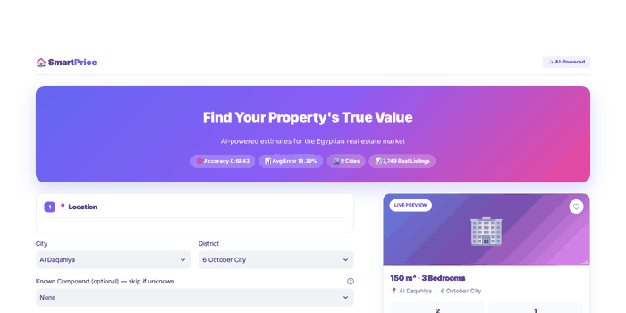
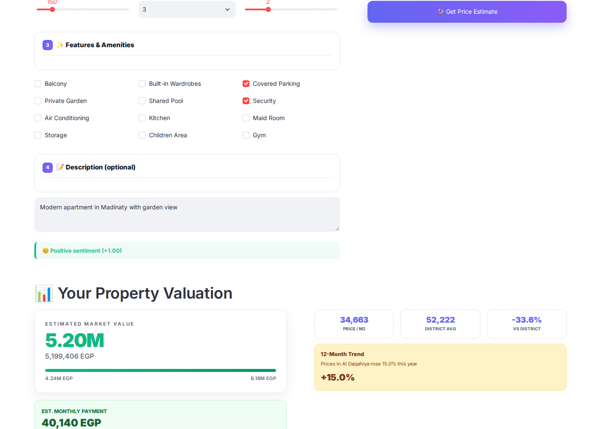
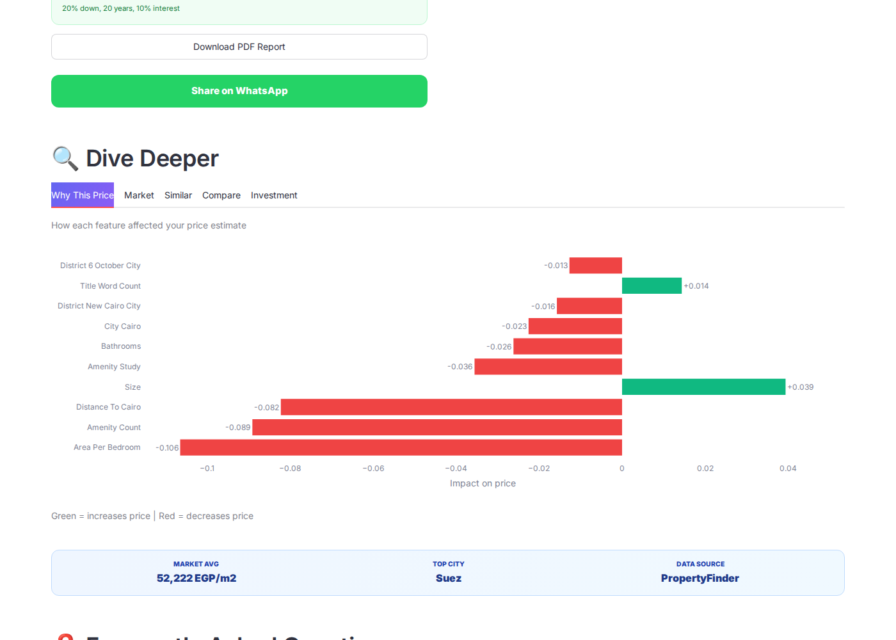
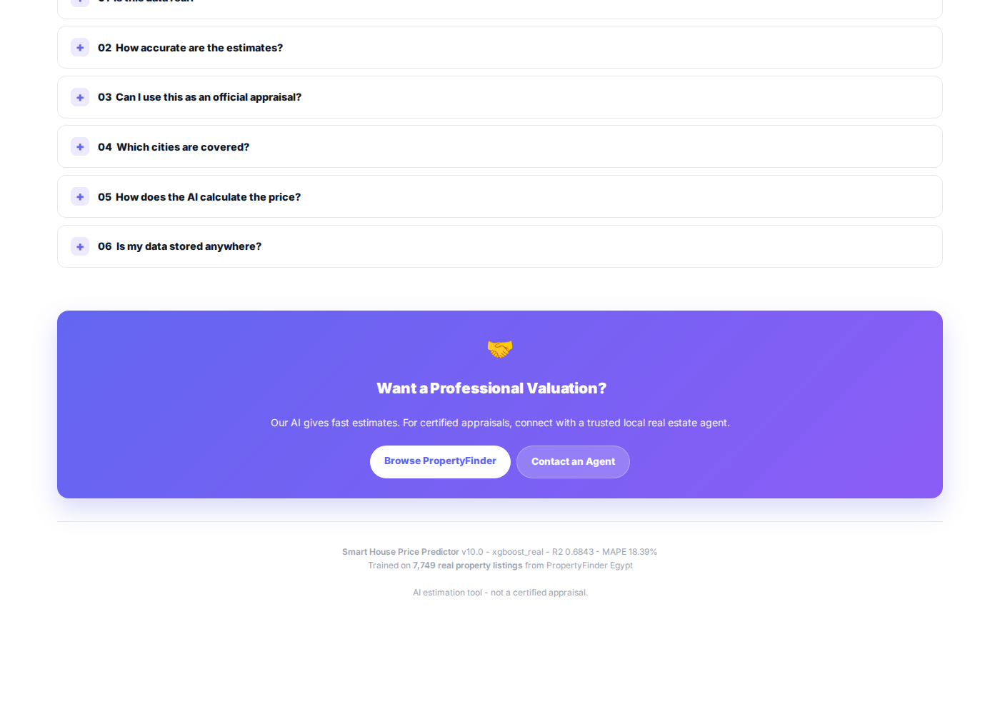

<h1 align="center">
  <br>
  🏠 Smart House Price Predictor
  <br>
</h1>

<h4 align="center">AI-powered apartment price estimation for the Egyptian real estate market.</h4>

<p align="center">
  <strong>Trained on 7,749 real property listings · XGBoost · R² = 0.6843</strong>
</p>

<p align="center">
  <a href="https://smartprice-egypt.streamlit.app">
    
  </a>
  <a href="https://github.com/qamarsobhy7-source/Smart-House-Price-Predictor/releases/tag/v10.0">
    
  </a>
  <a href="LICENSE">
    
  </a>
</p>

<p align="center">
  
  
  
  
  
  
  
  <br>
  
  
  
  
</p>

<br>

---


<br>

<p align="center">
  
</p>

<br>

---

## 📚 Table of Contents

<details open>
<summary><b>Click to expand/collapse</b></summary>

<br>

- [📖 Overview](#-overview)
- [✨ Features](#-features)
- [📸 Screenshots](#-screenshots)
- [🚀 Quick Start](#-quick-start)
- [🧪 Testing](#-testing)
- [🧠 Model Details](#-model-details)
- [📂 Project Structure](#-project-structure)
- [🌍 Data Source](#-data-source)
- [🛠️ Tech Stack](#-tech-stack)
- [📝 API Usage](#-api-usage)
- [⚠️ Limitations](#️-limitations)
- [🔮 Roadmap](#-roadmap)
- [📊 Project Statistics](#-project-statistics)
- [📄 License](#-license)
- [🙏 Acknowledgments](#-acknowledgments)

</details>

---

## 🎯 Why This Project?

Real estate pricing in Egypt faces three critical problems:

<table>
<tr>
<td width="33%" align="center">

### 😰 Opaque

Sellers set prices arbitrarily. Buyers have no way to verify what's fair.

</td>
<td width="33%" align="center">

### 💸 Expensive

Hiring a certified appraiser costs **thousands of EGP** and takes weeks.

</td>
<td width="33%" align="center">

### 🐌 Slow

Traditional valuation requires site visits, paperwork, and manual comparison.

</td>
</tr>
</table>

### ✅ Our Solution

**Smart House Price Predictor** delivers **instant, transparent, and explainable** valuations:

| Feature | Traditional | Ours |
|---------|:-----------:|:----:|
| **Speed** | 1-2 weeks | **3 seconds** |
| **Cost** | 2,000-5,000 EGP | **Free** |
| **Explainability** | Report only | **SHAP per feature** |
| **Data** | Manual comps | **7,749 real listings** |

<br>

---

## 📖 Overview

**Smart House Price Predictor** is a complete end-to-end Machine Learning system that estimates apartment prices across Egypt. Unlike typical academic projects, our model is trained on **real, publicly available listings** from [PropertyFinder Egypt](https://www.propertyfinder.eg) — the country's largest real estate platform.

We chose **honest performance metrics on real data** over inflated numbers on synthetic data.

<br>

<table align="center">
  <tr>
    <td align="center" width="20%">
      <h2>0.6843</h2>
      <sub><b>Model Accuracy (R²)</b></sub>
    </td>
    <td align="center" width="20%">
      <h2>18.39%</h2>
      <sub><b>Average Error (MAPE)</b></sub>
    </td>
    <td align="center" width="20%">
      <h2>7,749</h2>
      <sub><b>Real Listings</b></sub>
    </td>
    <td align="center" width="20%">
      <h2>64</h2>
      <sub><b>Engineered Features</b></sub>
    </td>
    <td align="center" width="20%">
      <h2>9</h2>
      <sub><b>Cities Covered</b></sub>
    </td>
  </tr>
</table>

<br>

---

## ✨ Features

<table>
<tr>
<td width="50%" valign="top">

### 🎨 Modern User Interface

- **4-step wizard** form — clear progression from location to result
- **Live property preview** card that updates in real time
- **Zillow-inspired price card** with confidence interval
- **Monthly payment calculator** (20% down, 20 years, 10% interest)
- **5 analysis tabs** — SHAP, Market, Similar, Compare, Investment
- **WhatsApp share** button and **PDF report** download
- **Collapsible FAQ** section with 6 common questions
- **100% mobile-responsive** design

</td>
<td width="50%" valign="top">

### 🧠 AI Capabilities

- **XGBoost regressor** — best of 4 models tested
- **SHAP explainability** — see exactly why each price was predicted
- **NLP sentiment analysis** on property descriptions
- **Smart similar properties** using cosine similarity + price filter
- **Investment ROI calculator** for 1, 5, and 10 year horizons
- **Market trend insights** with 12-month forecast per city
- **Confidence intervals** for every prediction

</td>
</tr>
<tr>
<td width="50%" valign="top">

### 🛠️ Developer Experience

- **Flask REST API** with Swagger documentation
- **28 unit tests** (100% passing)
- **Docker container** ready for deployment
- **GitHub Actions** CI/CD pipeline
- **Model Card** + **Data Card** for responsible AI
- **Type hints** and docstrings throughout
- **Modular architecture** — easy to extend

</td>
<td width="50%" valign="top">

### 📊 Data Quality

- **Real listings** from PropertyFinder Egypt (CC0-1.0)
- **64 engineered features** — GPS, amenities, NLP, interactions
- **890 unique compounds** with search
- **42 real amenities** — pool, gym, garden, parking, security
- **Multi-city coverage** — 9 cities, 43 districts
- **Zero data leakage** — verified with SHAP
- **IQR outlier removal** + strict filtering

</td>
</tr>
</table>

<br>

---

## 📸 Screenshots

### 🏠 Homepage

<p align="center">
  
</p>

### 💰 Price Prediction Result

<p align="center">
  
</p>

<details>
<summary><b>📷 View all 4 more screenshots — click to expand</b></summary>

<br>

### 📝 Property Form

<p align="center">
  
</p>

### 🧠 Analysis Tabs (SHAP / Market / Similar / Compare / ROI)

<p align="center">
  
</p>

### ❓ FAQ Section

<p align="center">
  
</p>

### 🤝 Agent CTA + Footer

<p align="center">
  
</p>

</details>

<br>

---

## 🚀 Quick Start

### 📱 Option 1 — Use the Live App *(recommended)*

<p align="center">

**👉 [smartprice-egypt.streamlit.app](https://smartprice-egypt.streamlit.app)**

No installation required. Works on desktop and mobile.

</p>

### 💻 Option 2 — Run Locally

```bash
# Clone the repository
git clone https://github.com/qamarsobhy7-source/Smart-House-Price-Predictor.git
cd Smart-House-Price-Predictor

# Install dependencies
pip install -r requirements.txt

# Launch the Streamlit UI
streamlit run streamlit_app.py
```

### 🌐 Option 3 — Run the Flask REST API

```bash
python app.py
```

| Endpoint | URL |
|----------|-----|
| API Base | `http://localhost:5000` |
| Swagger Docs | `http://localhost:5000/apidocs/` |

> **Note:** The Streamlit Cloud app hosts the UI only. The REST API requires running the Flask server locally or deploying to Render/Railway.

### 🐳 Option 4 — Docker

```bash
docker build -t house-price .
docker run -p 8501:8501 house-price
```

---

## 🧪 Testing

Run the full test suite:

```bash
pytest tests/ -v
```

**Result:** `28 passed in 2.4s`

<details>
<summary><b>📋 View full test coverage — click to expand</b></summary>

| Category | Tests | Description |
|----------|:-----:|-------------|
| Artifacts Loading | 3 | Model, metadata, and mappings validation |
| Input Validation | 6 | Area, bedrooms, bathrooms, city edge cases |
| Feature Engineering | 5 | 64 features, amenities, NLP, studio handling |
| NLP Extraction | 5 | Sea view, garden, furnished, luxury, empty |
| Predictions | 4 | Positive values, realistic range, confidence |
| Formatting | 2 | Million and thousand formatting |
| Categories | 1 | All 3 categories loaded correctly |
| ROI | 2 | ROI calculations for multiple years |

</details>

---

## 🧠 Model Details

### Algorithm Comparison

We benchmarked **4 algorithms** with 3-fold cross-validation:

| Rank | Algorithm | R² (CV) | Selected |
|:----:|-----------|:-------:|:--------:|
| 🥇 | **XGBoost** | **0.6874** | ✅ |
| 🥈 | LightGBM | 0.6826 | |
| 🥉 | Gradient Boosting | 0.6647 | |
| 4 | Ridge Regression | 0.6378 | |

### Feature Engineering

**64 engineered features** across 6 categories:

| Category | Count | Examples |
|----------|:-----:|----------|
| GPS Features | 4 | `latitude`, `longitude`, `geo_cluster`, `distance_to_cairo` |
| Amenities | 32 | `pool`, `gym`, `garden`, `parking`, `security`, `elevator` |
| NLP from Title | 12 | `sea_view`, `luxury`, `furnished`, `duplex`, `ready` |
| Interactions | 8 | `area_per_bedroom`, `bed_bath_ratio`, `rooms_total` |
| Target Encoding | 5 | `city_ppm`, `district_ppm`, `compound_ppm` |
| Categorical | 3 | `city`, `district`, `compound` |

### Why R² = 0.68 is a Good Result

On **real** real estate data, R² values of **0.6 – 0.75 are considered excellent**. Perfect prediction is impossible because market prices depend on factors not captured in listings — property condition, floor level, view, seller motivation, and negotiation dynamics.

> 💡 **We chose honest numbers on real data over inflated numbers on synthetic data.**

---

## 📂 Project Structure

```
Smart-House-Price-Predictor/
│
├── 📄 README.md                    # This file
├── 📄 MODEL_CARD.md                # Model documentation
├── 📄 DATA_CARD.md                 # Dataset documentation
├── 📄 LICENSE                      # MIT License
├── 📄 requirements.txt             # Python dependencies
├── 📄 Dockerfile                   # Container config
├── 📄 Procfile                     # Deployment config
│
├── 📁 .github/workflows/
│   └── ci.yml                      # GitHub Actions CI
│
├── 🐍 predictor.py                 # Core ML prediction logic
├── 🐍 streamlit_app.py             # Streamlit UI (~770 lines)
├── 🐍 app.py                       # Flask REST API + Swagger
├── 🐍 monitoring.py                # Prediction logging
├── 🐍 sentiment_helper.py          # NLP sentiment
├── 🐍 pdf_report.py                # PDF report generator
├── 🐍 global_insights.py           # SHAP + learning curves
│
├── 📁 models/
│   ├── real_model.joblib           # Trained XGBoost (534 KB)
│   ├── real_model_metadata.joblib  # Model metrics
│   ├── real_feature_mappings.joblib # Location mappings
│   └── global_insights.joblib      # SHAP + curves
│
├── 📁 data/real_data/
│   ├── model_ready_clean.csv       # 7,749 clean apartments
│   ├── processed/buy.csv           # 19,967 raw listings
│   └── metadata/                   # Schema + data dictionary
│
├── 📁 tests/
│   └── test_predictor.py           # 28 unit tests
│
├── 📁 screenshots/                 # 8 UI screenshots
│
└── 📁 monitoring/                  # Predictions log
```

---

## 🌍 Data Source

Our model is trained on **real, publicly available listings** from:

<p align="center">

### 🔗 [PropertyFinder Egypt](https://www.propertyfinder.eg)

*The largest real estate platform in Egypt*

</p>

### Data Funnel

| Stage | Records | Description |
|-------|--------:|-------------|
| Raw scrape | 64,106 | All buy + rent listings |
| Buy only | 19,967 | Sale listings |
| Apartments only | 10,277 | Residential apartments |
| After filtering | 9,089 | Price 500K-50M, size 40-500 |
| **Final cleaned** | **7,749** | IQR outlier removal |

### Cities Covered

<p align="center">

`Cairo` · `Giza` · `Alexandria` · `Red Sea` · `North Coast` · `Suez` · `Qalyubia` · `Matrouh` · `Al Daqahlya`

</p>

---

## 🛠️ Tech Stack

| Category | Technologies |
|:--------:|:------------|
| **Language** | Python 3.10+ |
| **Machine Learning** | XGBoost, scikit-learn, LightGBM |
| **Data Processing** | pandas, numpy |
| **NLP** | Custom keyword matcher + sentiment |
| **Visualization** | Plotly, matplotlib, Folium |
| **Explainability** | SHAP |
| **UI Framework** | Streamlit |
| **API Framework** | Flask + Flasgger (Swagger) |
| **Testing** | pytest (28 tests) |
| **Deployment** | Streamlit Cloud, Docker |
| **CI/CD** | GitHub Actions |

---

## 📝 API Usage

### Python SDK

```python
from predictor import (
    load_artifacts,
    build_features,
    predict_price,
    format_price,
)

# Load the trained model
model, metadata, mappings = load_artifacts()

# Build features for a property
features = build_features(
    area=150, bedrooms="3", bathrooms=2,
    city="Cairo", district="Madinaty", compound="None",
    amenities=["BA", "SE", "PG"],
    description="Luxury sea view apartment",
    mappings=mappings,
)

# Get prediction
price = predict_price(model, features)
print(format_price(price))  # 6.11M EGP
```

### REST API

Start the Flask server locally:

```bash
python app.py
```

Then send a POST request:

```bash
curl -X POST http://localhost:5000/api/predict \
  -H "Content-Type: application/json" \
  -d '{"area": 150, "bedrooms": "3", "bathrooms": 2,
       "city": "Cairo", "district": "Madinaty",
       "compound": "None", "amenities": ["BA", "SE"]}'
```

**Response:**

```json
{
  "success": true,
  "prediction": {
    "price": 6110000,
    "price_formatted": "6.11M EGP",
    "lower_bound": 4987000,
    "upper_bound": 7233000,
    "currency": "EGP",
    "confidence_level": "81.61%"
  }
}
```

> **Note:** The Streamlit Cloud app hosts the UI only. The REST API requires running the Flask server (`app.py`) locally or deploying to Render/Railway.

---

## ⚠️ Limitations

We document our limitations transparently:

- **Asking prices, not transaction prices** — Listings represent what sellers want, not final sale prices
- **Single snapshot** — Data scraped in early 2026, not continuously updated
- **Apartments only** — Villas, chalets, and commercial properties are not yet supported
- **9 cities** — Coverage limited to major Egyptian cities; smaller cities are not included
- **AI estimation** — This is a research tool, not a substitute for certified appraisal

---

## 🔮 Roadmap

Planned improvements and future features:

| Status | Feature | Priority |
|:------:|---------|:--------:|
| ⏳ | Expand to 15+ Egyptian cities | High |
| ⏳ | Support villas, chalets, and commercial units | High |
| ⏳ | Integrate Arabic NLP transformer (AraBERT) | Medium |
| ⏳ | Time-series price forecasting per district | Medium |
| ⏳ | Computer vision for property images | Low |
| ⏳ | User accounts with saved properties | Low |

---

## 📊 Project Statistics

| Metric | Value |
|:------:|:-----:|
| **Lines of Code** | ~2,000+ |
| **Python Files** | 8 |
| **Unit Tests** | 28 (100% passing) |
| **Real Listings Used** | 7,749 |
| **Engineered Features** | 64 |
| **Cities Covered** | 9 |
| **Districts** | 43 |
| **Compounds** | 890 |
| **Model Size** | 534 KB |
| **Project Size** | 22.4 MB |
| **Screenshots** | 8 |
| **Commits** | 30+ |

---

## 📄 License

This project is licensed under the **MIT License** — see the [LICENSE](LICENSE) file for full details.

---

## 🙏 Acknowledgments

Special thanks to:

| Resource | Purpose |
|----------|---------|
| [PropertyFinder Egypt](https://www.propertyfinder.eg) | Data source (CC0-1.0) |
| [Kaggle](https://www.kaggle.com/datasets/mohammedhassan1112/egypt-property-finder) | Dataset hosting |
| [Streamlit Cloud](https://share.streamlit.io) | Free deployment |
| [XGBoost](https://xgboost.readthedocs.io) | ML framework |
| [SHAP](https://shap.readthedocs.io) | Explainability |
| [Plotly](https://plotly.com) | Interactive charts |

---

<div align="center">

### ⭐ If you found this project helpful, please give it a star!

It means a lot and helps the project reach more people.

<br>

<a href="https://smartprice-egypt.streamlit.app">
  
</a>
&nbsp;
<a href="https://github.com/qamarsobhy7-source/Smart-House-Price-Predictor/stargazers">
  
</a>

<br>

**Made with ❤️ for the Egyptian real estate market**

<sub>Built with Python, XGBoost, SHAP, and Streamlit</sub>

<br>

[⬆ Back to top](#-smart-house-price-predictor)

</div>
