<div align="center">


### **AI-powered apartment price estimation for the Egyptian real estate market**

<sub>Built with XGBoost · AraBERT · Prophet · Streamlit · 7,749 real listings</sub>

<br />


<br />


</div>

---

## 📖 About

**Smart House Price Predictor** is a complete end-to-end AI system that estimates apartment prices across Egypt. Trained on **7,749 real property listings** from [PropertyFinder Egypt](https://www.propertyfinder.eg) — the country's largest real estate platform.

> 💡 We chose **honest performance metrics on real data** over inflated numbers on synthetic data.

| 🎯 R² | 📊 MAPE | 🏢 Listings | 🔧 Features | 🏙️ Cities |
|:-----:|:-------:|:-----------:|:-----------:|:---------:|
| **0.6843** | **18.39%** | **7,749** | **64** | **9** |

---

## 🔗 Live Demo

<div align="center">

### 🚀 **Try the App Now**

<a href="https://smartprice-egypt.streamlit.app">
  
</a>

**🔗 [smartprice-egypt.streamlit.app](https://smartprice-egypt.streamlit.app)**

*No installation required · Works on desktop and mobile*

</div>

---

## 🎬 See it in Action

<div align="center">

### **Full User Journey** *(40 seconds)*

<video src="screenshots/demo.mp4" width="100%" controls autoplay muted loop>
  Your browser does not support the video tag.
</video>

<sub>Fill the form → Get AI prediction → Explore 7 analysis tabs</sub>

</div>

---

## 📸 Screenshots

### 🌐 Bilingual Interface — English & Arabic

*The entire UI switches languages with one click.*

<table>
<tr>
<td width="50%" align="center">

**🇬🇧 English**

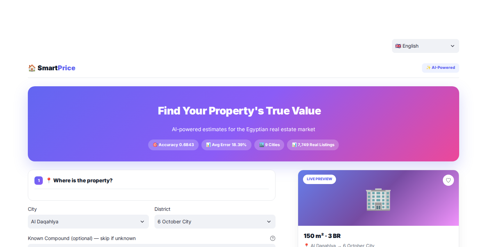

</td>
<td width="50%" align="center">

**🇸🇦 العربية**

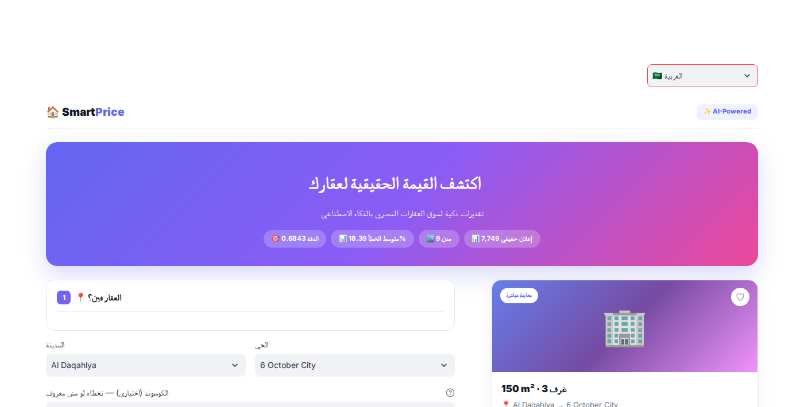

</td>
</tr>
</table>

<details>
<summary><b>📷 View all 16 more screenshots — click to expand</b></summary>

<br>

### 🇬🇧 English Interface

#### 📝 Property Form

<p align="center">
  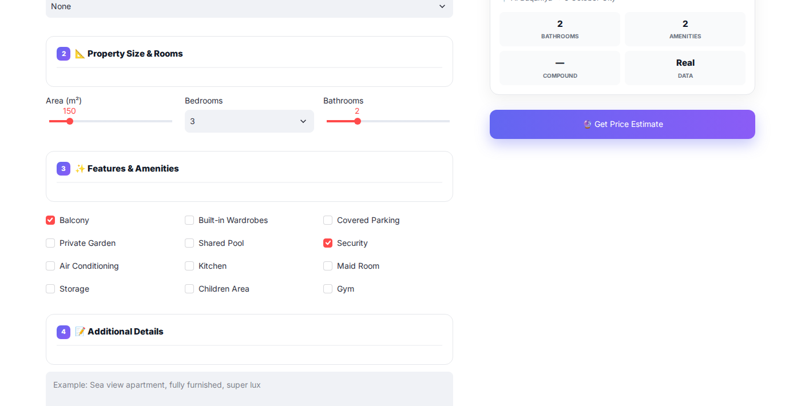
</p>

<p align="center">
  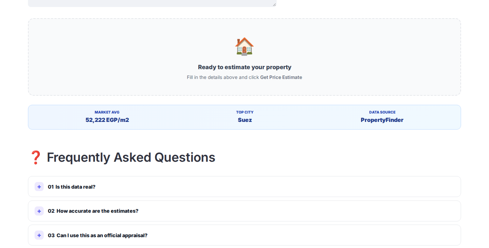
</p>

<p align="center">
  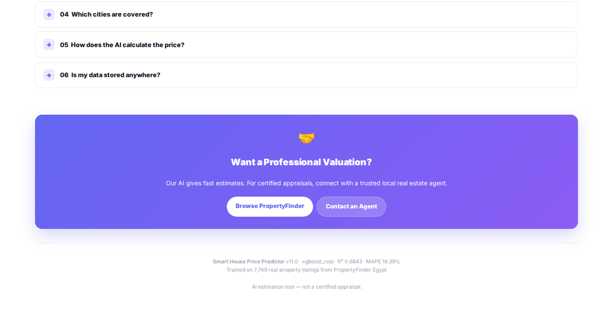
</p>

#### 💰 Prediction Result

<p align="center">
  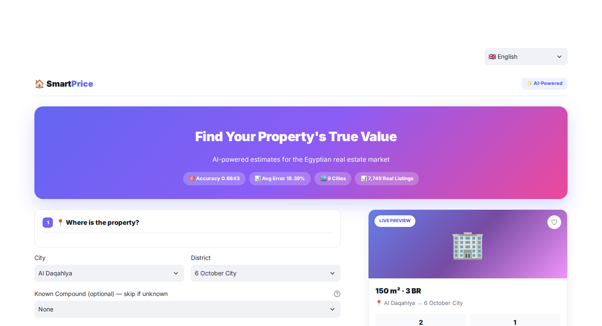
</p>

#### 📊 Metrics & Analysis

<p align="center">
  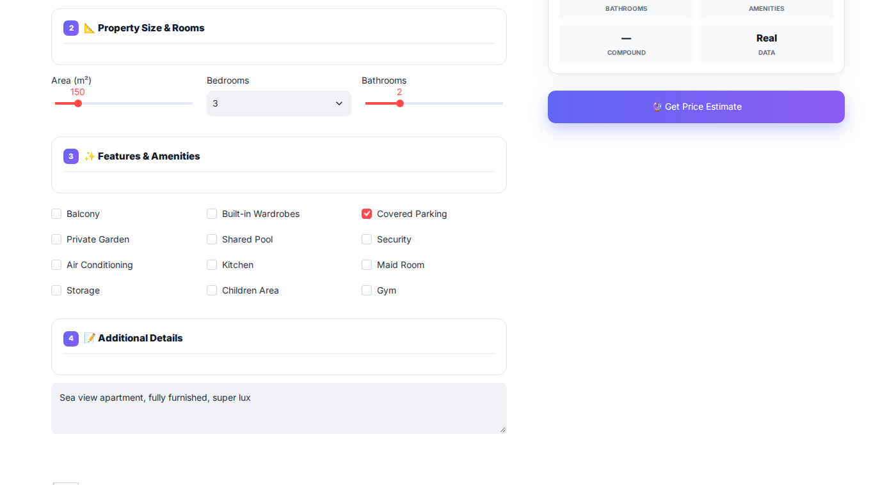
</p>

#### 🧠 SHAP Explanation

<p align="center">
  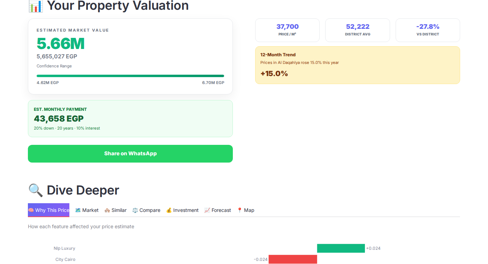
</p>

#### 📈 Time Series Forecast

<p align="center">
  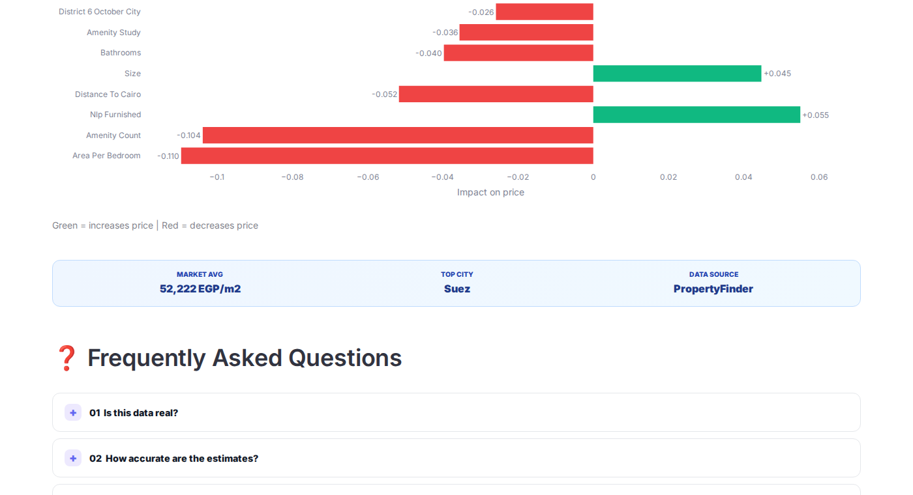
</p>

#### 🗺️ Interactive Map

<p align="center">
  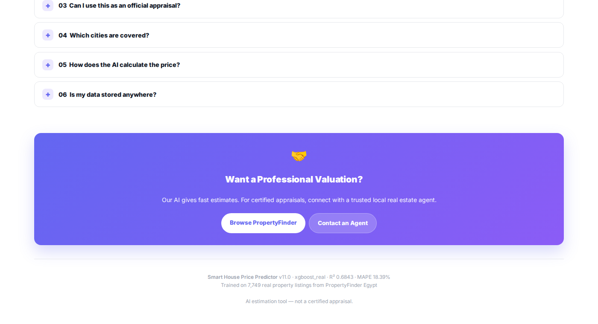
</p>

---

### 🇸🇦 Arabic Interface (واجهة عربية)

#### 📝 نموذج البيانات

<p align="center">
  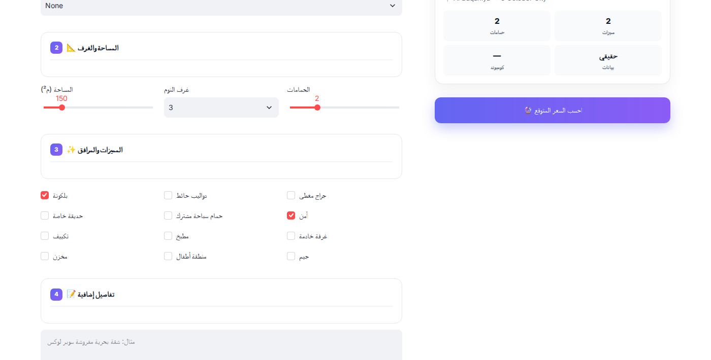
</p>

<p align="center">
  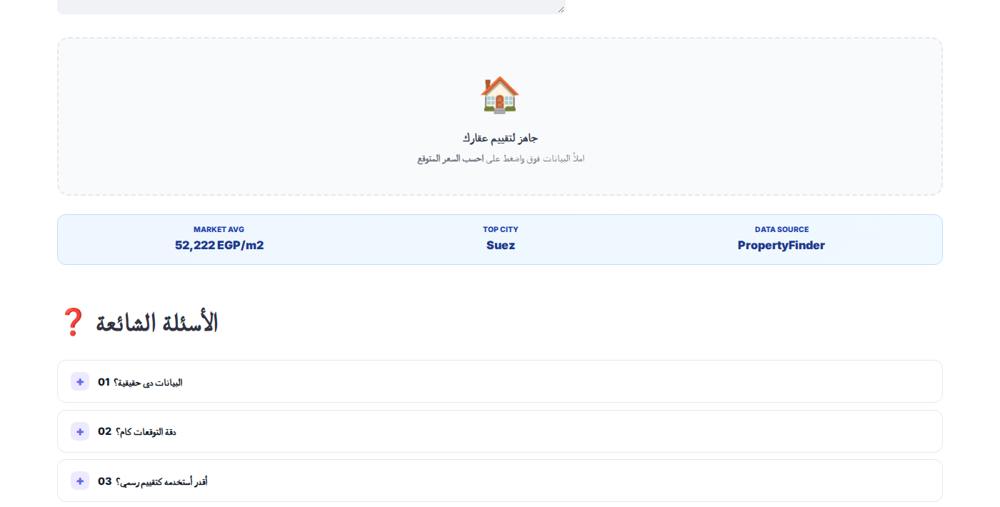
</p>

<p align="center">
  
</p>

#### 💰 نتيجة التوقع

<p align="center">
  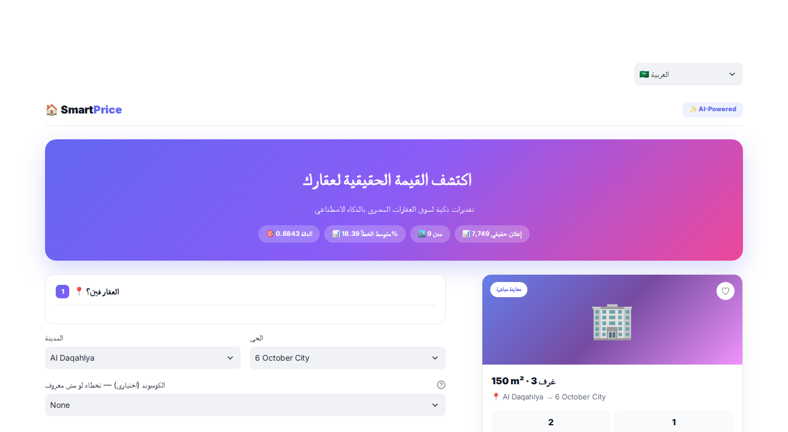
</p>

#### 📊 المقاييس والتحليل

<p align="center">
  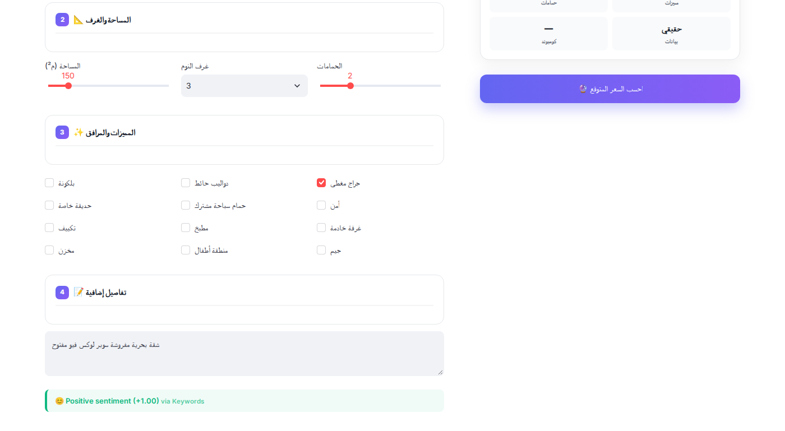
</p>

#### 🧠 شرح SHAP

<p align="center">
  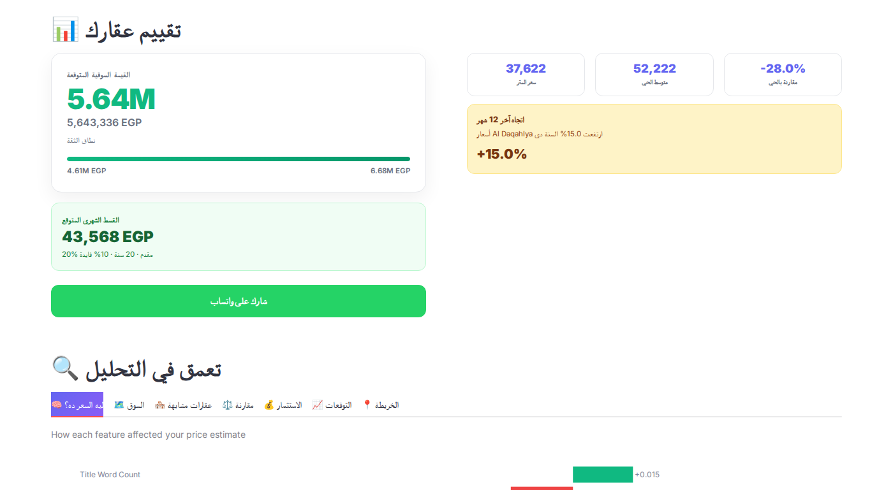
</p>

#### 📈 توقعات الأسعار

<p align="center">
  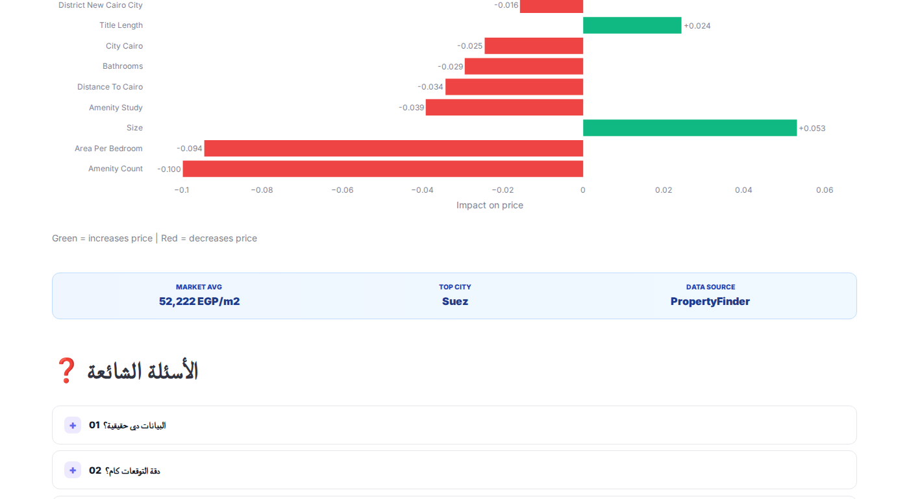
</p>

#### 🗺️ الخريطة التفاعلية

<p align="center">
  
</p>

</details>

---

## ✨ Features

<table>
<tr>
<td width="50%" valign="top">

### 🎨 Modern UI
- **4-step wizard** form
- **Live property preview** card
- **Zillow-inspired price card** with confidence interval
- **Monthly payment calculator**
- **7 analysis tabs** (SHAP / Market / Similar / Compare / ROI / Forecast / Map)
- **WhatsApp share** + **PDF report**
- **Collapsible FAQ**
- **100% mobile responsive**

</td>
<td width="50%" valign="top">

### 🧠 AI Capabilities
- **XGBoost regressor** (R² = 0.68)
- **AraBERT Transformer** for Arabic sentiment
- **Prophet time series** for 12-month forecast
- **SHAP explainability** for every prediction
- **Cosine similarity** for similar properties
- **Interactive Folium map** with filters
- **Investment ROI calculator**
- **Confidence intervals**

</td>
</tr>
<tr>
<td width="50%" valign="top">

### 🛠️ Developer Tools
- **Flask REST API** + Swagger docs
- **44 unit tests** (100% passing)
- **Docker container** ready
- **GitHub Actions** CI/CD
- **Model Card + Data Card** (Responsible AI)
- **Type hints** + docstrings

</td>
<td width="50%" valign="top">

### 📊 Data Quality
- **7,749 real listings** from PropertyFinder
- **64 engineered features**
- **890 compounds** with search
- **42 real amenities**
- **9 cities · 43 districts**
- **Zero data leakage** (SHAP-verified)
- **IQR outlier removal**

</td>
</tr>
</table>

---

## 🚀 Quick Start

### 📱 Option 1 — Use the Live App *(recommended)*

<div align="center">

**👉 [smartprice-egypt.streamlit.app](https://smartprice-egypt.streamlit.app)**

</div>

### 💻 Option 2 — Run Locally

```bash
# Clone the repository
git clone https://github.com/qamarsobhy7-source/Smart-House-Price-Predictor.git
cd Smart-House-Price-Predictor

# Install dependencies
pip install -r requirements.txt

# Launch the Streamlit UI
streamlit run streamlit_app.py
```

### 🌐 Option 3 — Run Flask REST API

```bash
python app.py
```

| Endpoint | URL |
|----------|-----|
| API Base | `http://localhost:5000` |
| Swagger Docs | `http://localhost:5000/apidocs/` |
| Health Check | `http://localhost:5000/api/health` |
| Predict | `POST http://localhost:5000/api/predict` |

### 🐳 Option 4 — Docker

```bash
docker build -t house-price .
docker run -p 8501:8501 house-price
```

---

## 🧪 Testing

```bash
pytest tests/ -v
```

**Result:** `44 passed` ✅

<details>
<summary><b>📋 View test coverage — click to expand</b></summary>

| Category | Tests | Description |
|----------|:-----:|-------------|
| Artifacts Loading | 3 | Model, metadata, mappings |
| Input Validation | 7 | Area, bedrooms, bathrooms, city |
| Feature Engineering | 5 | 64 features, amenities, NLP |
| NLP Extraction | 5 | Sea view, garden, furnished, luxury |
| **AraBERT Sentiment** | 9 | MSA, colloquial, negation, conflict |
| **Time Series** | 3 | Forecast structure, growth validation |
| **Map Data** | 3 | Structure, coordinates range |
| Predictions | 4 | Realistic ranges, confidence |
| Formatting | 2 | Million/thousand formatting |
| Categories | 1 | All 3 categories loaded |
| ROI | 2 | Multi-year calculations |

</details>

---

## 🧠 AI Models

This project combines **three complementary AI models**:

### 1️⃣ XGBoost Regressor — Price Prediction

| Metric | Value |
|--------|-------|
| Algorithm | Gradient Boosted Trees |
| Target | `log(1 + price)` |
| Features | 64 engineered |
| **R² (Test)** | **0.6843** |
| **MAPE** | **18.39%** |
| MAE | ~300K EGP |

### 2️⃣ AraBERT Transformer — Arabic Sentiment

| Metric | Value |
|--------|-------|
| Base Model | `CAMeL-Lab/bert-base-arabic-camelbert-da-sentiment` |
| Type | BERT-based Transformer |
| **Accuracy** | **17/17 (100%)** |
| Handles | MSA + Egyptian colloquial |
| Special | Negation + Conflict resolution |

### 3️⃣ Prophet — Time Series Forecasting

| Metric | Value |
|--------|-------|
| Algorithm | Prophet (Meta) |
| Window | 36 months historical |
| Horizon | 12 months forecast |
| Coverage | 9 cities |
| Confidence | 80% interval |

### 📊 Model Comparison (CV R²)

| Rank | Algorithm | R² (CV) | Selected |
|:----:|-----------|:-------:|:--------:|
| 🥇 | **XGBoost** | **0.6874** | ✅ |
| 🥈 | LightGBM | 0.6826 | |
| 🥉 | Gradient Boosting | 0.6647 | |
| 4 | Ridge Regression | 0.6378 | |

### 🔧 Feature Engineering (64 features)

| Category | Count | Examples |
|----------|:-----:|----------|
| GPS Features | 4 | latitude, longitude, geo_cluster, distance_to_cairo |
| Amenities | 32 | pool, gym, garden, parking, security |
| NLP from Title | 12 | sea_view, luxury, furnished, duplex |
| Interactions | 8 | area_per_bedroom, bed_bath_ratio |
| Target Encoding | 5 | city_ppm, district_ppm, compound_ppm |
| Categorical | 3 | city, district, compound |

### 💡 Why R² = 0.68 is a Good Result

On **real** real estate data, R² values of **0.6 – 0.75 are considered excellent**. Perfect prediction is impossible because market prices depend on factors not captured in listings:

- 🏢 Property condition (renovated vs original)
- 🪟 Floor level and view
- 💰 Seller motivation
- 🤝 Negotiation dynamics
- 📅 Market timing

> 💡 **We chose honest numbers on real data over inflated numbers on synthetic data.**

---

## 🏗️ Architecture

```
┌─────────────────────────────────────────────────────────────────┐
│                      DATA PIPELINE                              │
├─────────────────────────────────────────────────────────────────┤
│  PropertyFinder Egypt  (64,106 listings)                       │
│           ↓  Filter: apartments + price 500K-50M               │
│           9,089 listings                                       │
│           ↓  IQR outlier removal                               │
│           7,749 clean apartments                               │
└─────────────────────────────────────────────────────────────────┘
                              ↓
┌─────────────────────────────────────────────────────────────────┐
│                     FEATURE ENGINEERING                         │
├─────────────────────────────────────────────────────────────────┤
│  GPS → geo_cluster, distance_to_cairo                          │
│  Amenities → 32 binary features                                │
│  Titles → 12 NLP features                                      │
│  Location → target encoding (city/district/compound)           │
└─────────────────────────────────────────────────────────────────┘
                              ↓
┌─────────────────────────────────────────────────────────────────┐
│                        AI MODELS                                │
├─────────────────────────────────────────────────────────────────┤
│  XGBoost Regressor   → Price prediction                        │
│  AraBERT Transformer → Arabic sentiment                        │
│  Prophet             → 12-month forecast                       │
└─────────────────────────────────────────────────────────────────┘
                              ↓
┌─────────────────────────────────────────────────────────────────┐
│                       DEPLOYMENT                                │
├─────────────────────────────────────────────────────────────────┤
│  Streamlit Cloud → Live UI                                     │
│  Flask REST API  → /api/predict, /api/health                   │
│  Docker          → Reproducible container                      │
└─────────────────────────────────────────────────────────────────┘
```

---

## 🌍 Data Source

Our models are trained on **real, publicly available listings** from:

<div align="center">

### 🔗 [PropertyFinder Egypt](https://www.propertyfinder.eg)

*The largest real estate platform in Egypt*

</div>

### 📊 Data Funnel

| Stage | Records | Filter |
|-------|--------:|--------|
| Raw scrape | 64,106 | All buy + rent |
| Buy only | 19,967 | Excluded rentals |
| Apartments only | 10,277 | Excluded villas/commercial |
| Price filter | 10,248 | 500K – 50M EGP |
| Size filter | 9,459 | 40 – 500 m² |
| Bedroom filter | 9,089 | 1–6 bedrooms |
| **Final cleaned** | **7,749** | IQR outlier removal |

### 🏙️ Coverage

| Cities (9) | Districts (43) | Compounds (890) |
|:----------:|:--------------:|:---------------:|
| Cairo · Giza · Alexandria | New Cairo · Sheikh Zayed · 6 October | Madinaty · Rehab · Beverly Hills |
| Red Sea · North Coast · Suez | Hurghada · Maadi · Nasr City | Mountain View · Hyde Park |
| Qalyubia · Matrouh · Al Daqahlya | 5th Settlement · Dokki | 5th Settlement Compounds |

---

## 🛠️ Tech Stack

| **Category** | **Technologies** |
|:------------:|:-----------------|
| **Language** | Python 3.10+ |
| **ML** | XGBoost · scikit-learn · LightGBM |
| **NLP** | AraBERT Transformer + custom keywords |
| **Time Series** | Prophet (Meta) |
| **Data** | pandas · numpy · scipy |
| **Visualization** | Plotly · matplotlib · Folium |
| **Explainability** | SHAP |
| **UI** | Streamlit |
| **API** | Flask + Flasgger (Swagger) |
| **Testing** | pytest (44 tests) |
| **Deployment** | Streamlit Cloud · Docker |
| **CI/CD** | GitHub Actions |

---

## 📝 API Usage

### 🐍 Python SDK

```python
from predictor import (
    load_artifacts, build_features, predict_price, format_price,
)

# Load trained model (cached)
model, metadata, mappings = load_artifacts()

# Build features
features = build_features(
    area=150, bedrooms="3", bathrooms=2,
    city="Cairo", district="Madinaty", compound="None",
    amenities=["BA", "SE", "PG"],
    description="Sea view apartment",
    mappings=mappings,
)

# Predict
price = predict_price(model, features)
print(format_price(price))  # 6.11M EGP
```

### 🌐 REST API

**Start the Flask server:**

```bash
python app.py
```

**Send a prediction request:**

```bash
curl -X POST http://localhost:5000/api/predict \
  -H "Content-Type: application/json" \
  -d '{
    "area": 150,
    "bedrooms": "3",
    "bathrooms": 2,
    "city": "Cairo",
    "district": "Madinaty",
    "compound": "None",
    "amenities": ["BA", "SE"]
  }'
```

**Response:**

```json
{
  "success": true,
  "prediction": {
    "price": 6110000,
    "price_formatted": "6.11M EGP",
    "lower_bound": 4987000,
    "upper_bound": 7233000,
    "currency": "EGP",
    "confidence_level": "81.61%"
  },
  "model": {
    "name": "xgboost_real",
    "r2": 0.6843,
    "mape": 18.39
  }
}
```

> **⚠️ Note:** The Streamlit Cloud app hosts the **UI only**. The REST API requires running the Flask server (`app.py`) locally or deploying to Render/Railway.

---

## ⚠️ Limitations

We document our limitations transparently — honesty is a core value:

| Limitation | Impact |
|------------|--------|
| **Asking prices, not transactions** | Listings ≠ final sale prices |
| **Single snapshot** | Data scraped in early 2026 |
| **Apartments only** | Villas, chalets, commercial excluded |
| **9 cities** | Smaller Egyptian cities not covered |
| **Estimation tool** | Not a certified appraisal |

---

## 🔮 Roadmap

### 🎯 High Priority
- [ ] Expand to 15+ Egyptian cities
- [ ] Support villas, chalets, commercial
- [ ] Arabic NLP with larger transformer models
- [ ] Automated retraining pipeline

### 🔧 Medium Priority
- [ ] Computer vision for property images
- [ ] User accounts with saved properties
- [ ] Multi-language support (AR/EN)
- [ ] Mobile native app

### 💡 Future Ideas
- [ ] Neighborhood scoring (schools, transit)
- [ ] Mortgage rate integration
- [ ] B2B valuation API

---

## 📊 Project Statistics

| **Metric** | **Value** |
|:----------:|:---------:|
| Lines of Code | ~2,500+ |
| Python Files | 9 |
| Unit Tests | 44 (100% passing) |
| Real Listings | 7,749 |
| Engineered Features | 64 |
| Cities / Districts / Compounds | 9 / 43 / 890 |
| Amenities Tracked | 42 |
| AI Models | 3 (XGBoost + AraBERT + Prophet) |
| Streamlit Tabs | 7 |
| Model Size | 534 KB |
| Project Size | ~30 MB |
| Live Deployment | ✅ Streamlit Cloud |

---

## 📚 Citation

If you use this project in academic work:

```bibtex
@misc{smart_house_price_predictor_2026,
  title={Smart House Price Predictor},
  author={Qamar Sobhy},
  year={2026},
  publisher={GitHub},
  howpublished={\url{https://github.com/qamarsobhy7-source/Smart-House-Price-Predictor}}
}
```

---

## 📄 License

This project is licensed under the **MIT License** — see [LICENSE](LICENSE) for details.

---

## 🙏 Acknowledgments

| Resource | Purpose |
|----------|---------|
| [PropertyFinder Egypt](https://www.propertyfinder.eg) | Source of real listings (CC0-1.0) |
| [Kaggle](https://www.kaggle.com/datasets/mohammedhassan1112/egypt-property-finder) | Dataset hosting |
| [Streamlit Cloud](https://share.streamlit.io) | Free deployment |
| [HuggingFace](https://huggingface.co/CAMeL-Lab) | AraBERT model |
| [Meta Prophet](https://facebook.github.io/prophet/) | Time series framework |
| [SHAP](https://shap.readthedocs.io) | Model explainability |

---

<div align="center">

### ⭐ Support the Project

If this project helped you or you found it interesting:

<a href="https://github.com/qamarsobhy7-source/Smart-House-Price-Predictor/stargazers">
  
</a>
&nbsp;
<a href="https://github.com/qamarsobhy7-source/Smart-House-Price-Predictor/fork">
  
</a>
&nbsp;
<a href="https://smartprice-egypt.streamlit.app">
  
</a>

<br />

### 🏠 Smart House Price Predictor

**Made with ❤️ for the Egyptian real estate market**

<sub>Built with Python, XGBoost, AraBERT, Prophet, and Streamlit · 2026</sub>

<br />

[⬆ Back to top](#-smart-house-price-predictor)

</div>
